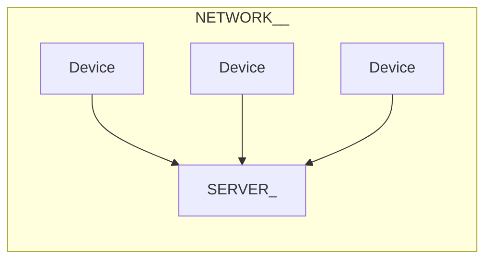
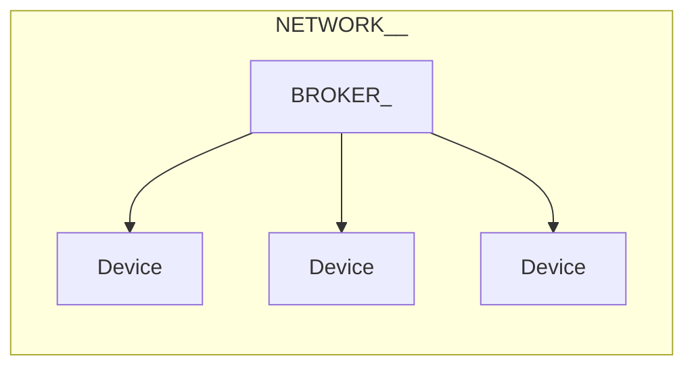

# Послушный дом и JS

## Женя Кучерявый

---
layout: image-right
image: /bazil.webp
---

# Женя Кучерявый

<br>

<v-clicks>

- Вольнодумец
- Суперзлодей

</v-clicks>

---
layout: center
class: text-center
---

<div class="tiny-title">Что такое «послушный дом»<span class="red">?</span></div>

---
layout: cover
---

<div style="font-size: 4rem;">Это система управления домашней сетью электрических
устройств<span class="red">,</span> которая слушается
владельца<span class="red">,</span> а не додумывает<span class="red">.</span></div>

---
layout: center
---

<div class="big-title text-center">Зачем<span class="red">?</span></div>

---

# Два зачем

<br>

<v-clicks>

1. Зачем делать послушный дом самому<span class="red">?</span>
2. Зачем делать это на JS<span class="red">?</span>

</v-clicks>

---
layout: image
image: /home-assistant.png
---

<Source value="https://www.home-assistant.io" />

---
layout: center
class: text-center
---

<div class="tiny-title" style="font-size: 5rem"><span class="red">«</span>У тебя не всегда будет интернет<span class="red">»</span></div>

---
layout: image
image: /zigbee.webp
backgroundSize: 37rem
class: bg-black
---

---
layout: image-right
image: /subaru-ad.webp
backgroundSize: 38rem
---

# Вы <span class="red">—</span> товар

<br>

<v-clicks>

- Смартфоны не чинятся
- Холодильники шпионят
- Принтеры не печают сторонними чернилами
- Лицензии меняются
- Автомобили отвлекают рекламой

</v-clicks>

<Source value="https://www.reddit.com/r/subaru/comments/1p57ohp/these_ads_should_not_be_happening_while_we_are" />

---
layout: center
class: text-center
---

<div class="tiny-title">Если я купил железку<span class="red">,</span> то это моя железка<span class="red">!</span></div>

---
layout: center
---

<div class="tiny-title">Это крутой навык</div>

---
layout: center
---

<div class="tiny-title" style="font-size: 4rem;">ИИ не заменит инженеров<span class="red">*</span></div>


<div style="position: fixed; bottom: 2rem; font-size: 2rem;"><span class="red">*</span> пока что</div>

---
layout: image
image: /chat-gpt-wiring.webp
backgroundSize: 39rem
---

<Arrow x1="50" x2="340" y1="300" y2="330" color="red" width="5" v-click />

<Source value="ChatGPT" />

---
layout: image
image: /chat-gpt-wiring-2.webp
backgroundSize: 39rem
---

<Source value="ChatGPT" />

---
layout: image
image: /bro-you-will-die.jpg
backgroundSize: 70rem
class: text-center
---

<div class="tiny-title bg-blur" style="font-size: 3rem">Бро, ты умрёшь и т. д.</div>

---
layout: image
image: /plug-wiring-risk.png
backgroundSize: 78rem
---

<Source value="ChatGPT" />

---
layout: image-left
image: /ololoshka.webp
---

# Мечта детства №<span color="red">2026</span>

<br>
<br>
<br>
<br>
<br>

<div style="font-size: 2.8rem;">Застать крах ИИ и многомиллиардные убытки ИТ-гигантов</div>

---
layout: center
class: text-center
---

<div class="tiny-title">Зачем делать на JS<span class="red">?</span></div>

---
layout: center
---

<div class="tiny-title"><span class="red">1.</span> Потому что мы можем</div>

---
layout: cover
---

<div class="tiny-title">
<span class="red">2.</span> Всё<span class="red">,</span> что может быть написано на JS<span class="red">,</span> будет написано на JS<span class="red">.</span>
</div>

---
layout: center
---

<div class="big-title">Как<span class="red">?</span></div>

---
layout: image
image: /nanomachines.jpg
---

<div class="tiny-title text-center bg-blur">Микроконтроллеры</div>

---
layout: cover
---

# Микроконтроллер <span class="red">—</span> программируемое устройство<span class="red">,</span> которое может принимать и отправлять электрические сигналы<span class="red">.</span>

---
layout: image
image: /esp32-chip.webp
backgroundSize: 60rem
---

<Arrow x1="800" x2="600" y1="400" y2="380" width="6" color="red" v-click />

---
layout: image-left
image: /esp32-chip.webp
backgroundSize: 40rem
---

# ESP-32

<br>

<v-clicks>

- 2 ядра 32-bit 240 MHz
- 520 KB SRAM
- 4 MB Flash-память
- Wi-Fi & Bluetooth
- До 32 пинов GPIO

</v-clicks>

---
layout: center
class: text-center
---

<div class="tiny-title">
General Purpose Input<span class="red">/</span>Output
<br>
<br>
Ввод<span class="red">/</span>вывод общего назначения
</div>

---
layout: image
image: /esp32.png
backgroundSize: 30rem
---

---
layout: image-left
image: /esp32.png
backgroundSize: 30rem
---

# ESP-32 DevKit

<br>

<v-clicks>

- Плата для разработки
- USB-порт для питания и прошивки
- Вывод пинов для удобной работы на макетной плате

</v-clicks>

---
layout: image
image: /pad/duck.webp
---

---
layout: image
image: /pad/esp.webp
---

---
layout: center
---

<div class="tiny-title">Как это работает<span class="red">?</span></div>

---
layout: center
---

<div class="small-title">HIGH <span class="red">/</span> LOW
<br>ВКЛ <span class="red">/</span> ВЫКЛ
</div>


---
layout: code
---

```js{all|2,5|3,6|8-13|9-12|10|11}
// DEVICE
const LED_PIN = 2
const BTN_PIN = 5

pinMode(LED_PIN, "output")
pinMode(BTN_PIN, "input")

setInterval(() => {
    digitalWrite(
        LED_PIN,
        digitalRead(BTN_PIN),
    )
}, 500)
```

---
preload: false
---

<HLExample />

---
layout: center
class: text-center
---

<div class="tiny-title" style="font-size: 4rem;">
Pulse<span class="red">-</span>width modulation
<br><br>Широтно<span class="red">-</span>импульсная модуляция
</div>

---
layout: center
---

<div style="font-size: 3rem;">
Микроконтроллер может выдавать на пинах либо 0 В<span class="red">,</span> либо 5 В<span class="red">.</span> <span v-click>Но если очень
быстро переключать напряжение<span class="red">,</span></span> <span v-click>то можно добиться эффекта<span class="red">,</span> как будто мы подаём
среднее арифметическое напряжение<span class="red">.</span></span>
</div>

---
layout: code
---

```js{all|2,4|6|8-13|9-12|10|11}
// DEVICE
const LED_PIN = 16

pinMode(LED_PIN, "output")

let brightness = 100

setInterval(() => {
    analogWrite(
        LED_PIN,
        brightness / 255,
    )
}, 500)
```

---
preload: false
---

<PwmExample />

---
layout: center
---

<div class="tiny-title">Любой пин можно использовать для ШИМ<span class="red">,</span> если захотеть</div>

---
layout: center
class: text-center
---

<div class="tiny-title">Последовательное питание</div>

---
preload: false
---

<DisplayExample />

---
layout: center
---

<div class="small-title">8 * 8 <span class="red">=</span> 64</div>

---
layout: center
---

<div class="tiny-title" style="font-size: 4.5rem;">1920 * 1080 <span class="red">=</span> 2 073 600</div>

---
layout: image
image: /8x8-matrix-black.png
---

<Source value="https://circuitstoday.com/interfacing-8x8-led-matrix-with-arduino" />

---
layout: center
---

<div class="small-title">8 + 8 <span class="red">=</span> 16</div>

---
layout: image
image: /led-matrix-chip-black.webp
---

<Arrow x1="700" x2="300" y1="350" y2="350" color="red" width="6" v-click />

<Source value="https://circuitdigest.com/microcontroller-projects/arduino-8x8-led-matrix" />

---
layout: center
---

<div class="small-title">I<sup class="red">2</sup>C|I<span class="red">2</span>C|IIC</div>

---
layout: image
image: /i2c-protocol.webp
backgroundSize: 75rem
---

# I<sup class="red">2</sup>C

<Source value="https://quanser-update.azurewebsites.net/quarc/documentation/i2c_protocol.html" />

---
layout: center
---

<div class="tiny-title">А что оно может<span class="red">?</span></div>

---
layout: image
image: /esp-pc-1.png
---

<Source value="https://youtu.be/HaO_yZFYG1Q" />

---
layout: image
image: /esp-pc-2.png
---

<Source value="https://youtu.be/HaO_yZFYG1Q" />

---
layout: center
---

# Для большинства проектов это оверкилл

---
layout: image
image: /shenzhen.png
---

<Source value="Shenzhen I/O"></Source>

---
layout: image
image: /shenzhen-docs.png
---

<Source value="Shenzhen I/O"></Source>

---
layout: cover
class: text-center
---

# Везенье, если <span class="green">есть</span> data sheet

---
layout: cover
class: text-center
---

# Веселье, если его <span class="red">нет</span>

---
layout: image
image: /pad/e-ink.webp
---

---
layout: image
image: /pad/e-ink-pins.webp
---

---
layout: image
image: /pad/acc.webp
---

---
layout: image
image: /reverse.webp
---


---
layout: image
image: /pad/tools.webp
---

---

# Инструменты

<br>

<v-clicks>

- Паяльник
- Флюс и припой
- Пинцет и кусачки
- Проводочки и термоусадки

</v-clicks>

---

# Как наладить связь

- WiFi
- Протоколы
- ESP now
- MQTT
- Много клиентов и один сервер
- Много серверов и один клиент
- Очередь сообщений

---
layout: center
---

<div class="tiny-title" style="font-size: 4rem;">1 Сервер <span class="red">&</span> Много клиентов</div>

---
layout: center
---



---
layout: code
---

````md magic-move
```js
// SERVER
let state = false

const server = http.createServer(async (req, res) => {
    switch (req.url) {
        case "/lamp/state":
            reply(res, 200, state ? "1" : "0")
            break
        case·"/lamp/toggle":
            state = !state
            reply(res, 200, state ? "1" : "0")
    }
})
```

```js
// DEVICE
pinMode(RELAY_PIN, "output")

setInterval(async () => {
    const res = await fetch(`${SERVER}/lamp/state`)

    digitalWrite(
        RELAY_PIN,
        Number(await res.text()),
    )
}, 400)
```

````

---
layout: center
---

<div class="tiny-title" style="font-size: 4rem;">Каждое устройство <span class="red">—</span> сервер</div>

---
layout: center
---



---
layout: code
---

````md magic-move

```js
// BROKER
let state = false

const server = http.createServer(async (req, res) => {
    switch (req.url) {
        case·"/lamp/toggle":
            state = !state
            const body = state ? "1" : "0"
            await fetch(DEVICE, { method: "POST", body })
            res.end(body)
    }
})
```

```js
// DEVICE
pinMode(RELAY_PIN, "output")

const server = http.createServer(async (req, res) => {
    switch (req.url) {
        case·"/update":
            digitalWrite(
                RELAY_PIN,
                Number(await res.text()),
            )
            res.end(body)
    }
})
```

````

---
layout: cover
---

# Лучше один раз отправить обновление на устройство<span class="red">,</span> чем всё время дудосить сервер<span class="red">.</span>

---

- Умная розетка
- Умная лампочка

---

KiCAD

---

FreeCAD

корпус

3D-печать

---

# Прошивка

Мы просто перекладываем байтики, чтобы что-то завелось, поэтому похуй, на чём
мы это делаем. Выбирают языки вроде Си в основном потому, что они изначально
под это заточены + потому что есть куча готовых инструментов.

---

Прошить плату можно даже через браузер

---

Управлять платой можно через браузер

---

Моргаем светодиодом на плате

---

блок питания

две вилки

---

бэкдоры в контроллерах

гпу в малинке не опенсорс

---
layout: image-right
image: /pad/lamp.webp
---

<div class="tiny-title" style="font-size: 2.5rem">
Атеисты такие типа<span class="red">:</span>
<br><br>
Это устройство работает благодаря высокому качеству сборки и хорошему коду</div>

---
class: small-table
---

# Зачем нужны веб-компоненты<span class="red">?</span>

<br>

<v-clicks>

| Фича | Результат |
|-|-|
| Инкапсуляция | <span class="orange">Сомнительно</span> |
| Удобство в поддержке | <span class="orange">Сомнительно</span> |
| Производительность | <span class="orange">Сомнительно</span> |
| Прогрессивное улучшение | <span class="green">Есть</span> |
| Переиспользование | <span class="green">Есть</span> |
| Интероп | <span class="orange">Сомнительно</span> |
| Стандартизация | <span class="red">Нет</span> |

</v-clicks>

---

# Что мы узнали<span class="red">?</span>

<br>

<v-clicks>

- Зачем делать что-то своими руками
- Что такое микроконтроллеры
- Как взаимодействуют компоненты
- Как подружить устройства по сети
- В каких случаях можно использовать JS
- В каких случаях это оправдано

</v-clicks>

---

# Спасибо за внимание

<br>

<Qr data="https://kucheriavyi.ru" label="kucheriavyi.ru" />

