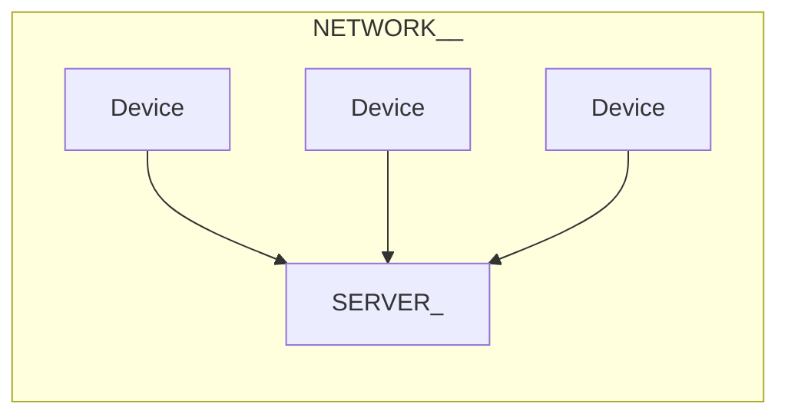
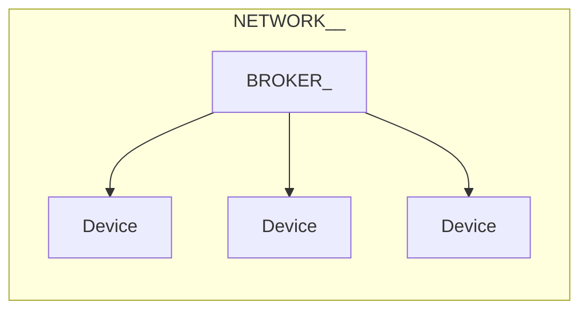

# Послушный дом и JS

## Женя Кучерявый

---
layout: image-right
image: /bazil.webp
---

# Женя Кучерявый

<br>

<v-clicks>

- Вольнодумец
- Суперзлодей

</v-clicks>

---
layout: cover
---

# Электроника на HolyJS<span class="red">?</span>

---

# Почему фротендеры идеально справятся с электроникой<span class="red">:</span>

<br>

<v-clicks>

- Любят называть себя инженерами
- Красили кнопки<span class="red">,</span> а будут красить светодиоды
- Электронику невозможно понять до конца <span class="red">(</span>и не нужно<span class="red">)</span>
- Фронтендер даже не попытается

</v-clicks>

---
layout: cover
---

# Этот доклад для тебя<span class="red">,</span> если ты знаешь<span class="red">,</span> что такое JavaScript

---
layout: cover
class: text-center
---

# Фокус на идеях

---
layout: two-cols
---

# Что будет<span class="red">:</span>

<br>

<v-clicks>

- Псевдокод
- Схемы
- База

</v-clicks>

::right::

# Чего не будет<span class="red">:</span>

<br>

<v-clicks>

- Пошаговых инструкций
- Трассировок
- Лишних абстракций

</v-clicks>

---
layout: image
image: /pad/duck.webp
---

---
layout: cover
---

# Что такое <span class="red">«</span>послушный дом<span class="red">»?</span>

---
layout: cover
---

# Это система управления домашней сетью электрических устройств<span class="red">,</span> которая слушается владельца<span class="red">,</span> а не додумывает

---
layout: cover
---

# Послушный дом почти как умный<span class="red">,</span> но тупой

<Source value="© Фонд золотых цитат" />

---

# Мы сделаем<span class="red">:</span>

<br>

<v-clicks>

- Умную лампочку<span class="red">/</span>розетку
- Голосового ассистента

</v-clicks>

---
layout: cover
---

# Зачем<span class="red">?</span>

---
layout: cover
---

# Зачем делать это самому<span class="red">?</span>

---
layout: image-right
image: /subaru-ad.webp
backgroundSize: 38rem
---

# Вендоры <span class="red">—</span> злые

TODO: картинки на каждый пункт

<br>

<v-clicks>

- Смартфоны не чинятся
- Холодильники шпионят
- Принтеры не печают сторонними чернилами
- Лицензии меняются
- Автомобили отвлекают рекламой

</v-clicks>

<Source value="https://www.reddit.com/r/subaru/comments/1p57ohp/these_ads_should_not_be_happening_while_we_are" />

---
layout: cover
---

# Если я купил железку<span class="red">,</span><br>то это моя железка<span class="red">!</span>

---
layout: image
image: /pad/radio.webp
---

---

<div><SlidevVideo
src="/pad/mic1.webm" :autoplay="true" :controls="false" :muted="true"
autoreset="slide"
style="position: absolute; width: 100%; height: 100%; top: 0; bottom: 0; left: 0; right: 0;" ></SlidevVideo>
</div>

---
layout: image
image: /pad/acc.webp
---

---
layout: image
image: /pad/speaker.webp
---

---
layout: image
image: /pad/speaker-lay.webp
---

---
layout: cover
---

# Полиция предупредила об опасности умных колонок<span class="red">:</span> могут шпионить

## МВД уличило умные колонки в подслушивании и подглядывании

<Source value="https://www.mk.ru/social/2026/03/23/policiya-predupredila-ob-opasnosti-umnykh-kolonok-mogut-shpionit.html" />

---
layout: image
image: /home-assistant.png
---

<Source value="https://www.home-assistant.io" />

---
layout: image-right
image: /rupert.jpg
backgroundSize: 35rem
---

<br>
<br>
<br>
<br>
<br>
<br>
<br>
<br>
<br>
<br>

# Не стоит недеяться на чужую инфраструктуру

<div class="bg-blur" style="position: absolute; right: 13rem; top: 3rem; font-size: 2rem;">Интернет</div>

<Source value="х/ф Гарри Поттер и Философский камень" />

---
layout: image
image: /zigbee.webp
backgroundSize: 37rem
class: bg-black
---

---
layout: cover
---

# Это не под силу ИИ<span class="red">*</span>


<div style="position: fixed; bottom: 2rem; font-size: 2rem;"><span class="red">*</span> пока что</div>

---
layout: image-left
image: /ololoshka.webp
---

# Мечта детства <span color="red">№</span>2026

<br>
<br>
<br>
<br>
<br>

<div style="font-size: 2.8rem;">Застать крах ИИ и многомиллиардные убытки ИТ<span class="red">-</span>гигантов</div>

---
layout: image
image: /chat-gpt-wiring.webp
backgroundSize: 39rem
---

<Arrow x1="50" x2="340" y1="300" y2="330" color="red" width="5" v-click />

<Source value="ChatGPT" />

---
layout: image
image: /chat-gpt-wiring-2.webp
backgroundSize: 39rem
---

<Source value="ChatGPT" />

---
layout: image
image: /bro-you-will-die.jpg
backgroundSize: 70rem
class: text-center
---

<div class="tiny-title bg-blur" style="font-size: 3rem">
Бро<span class="red">,</span> ты умрёшь и т<span class="red">.</span> д<span class="red">.</span>
</div>

---
layout: cover
---

# Это не шутка<span class="red">!</span> Будьте осторожны при работе с электричеством<span class="red">.</span> Особенно<span class="red">,</span> если просите советы у нейросетей

---
layout: image
image: /plug-wiring-risk.png
backgroundSize: 78rem
---

<Source value="ChatGPT" />

---
layout: cover
---

# Зачем делать это на JS<span class="red">?</span>

---
layout: cover
---

# <span class="red">1.</span> Потому что мы можем

---
layout: cover
---

# <span class="red">2.</span> Всё<span class="red">,</span> что может быть написано на JS<span class="red">,</span> будет написано на JS

---
layout: cover
---

# Голосовой ассистент

---
layout: image-right
image: /zero2-hero.webp
backgroundSize: 40rem
---

# Raspberry Pi Zero 2 W

<br>

<v-clicks>

- 4 ядра 64<span class="red">-</span>bit 1 GHz
- 512MB SDRAM
- Wi<span class="red">-</span>Fi <span class="red">&</span> Bluetooth
- Mini HDMI <span class="red">&</span> microSD
- CSI<span class="red">-</span>2 camera connector
- 40 пинов GPIO

</v-clicks>


<Source value="https://www.raspberrypi.com/products/raspberry-pi-zero-2-w/" />

---
layout: cover
---

# Есть Mini HDMI<span class="red">,</span> но нельзя использовать браузер для визуала <span class="red">—</span> слишком мало оперативки

---
layout: image
image: /larana.png
backgroundSize: 70rem
---

<Source value="https://larana.tech" />

---
layout: image
image: /pad/pi.webp
---

---
layout: image
image: /pad/sound-module.webp
---

---
layout: image
image: /pad/pi-sound.webp
---

---

<div><SlidevVideo
src="/pad/mic2.webm" :autoplay="true" :controls="false" :muted="true"
autoreset="slide"
style="position: absolute; width: 100%; height: 100%; top: 0; bottom: 0; left: 0; right: 0;" ></SlidevVideo>
</div>

---
layout: image
image: /pad/amp.webp
---

---
layout: image
image: /pad/speaker.webp
---

---
layout: image
image: /pad/speaker-lay.webp
---

---

<div><SlidevVideo
src="/pad/sound.webm" :autoplay="true" :controls="false" :muted="true"
autoreset="slide"
style="position: absolute; width: 100%; height: 100%; top: 0; bottom: 0; left: 0; right: 0;" ></SlidevVideo>
</div>

---

TODO: device photo

---
layout: cover
---

# Распознавание речи

---
layout: code
---

````md magic-move

```js
import fs from "fs"
import vosk from "vosk"
import record from "node-record-lpcm16"
import { exec } from "child_process"

const modelPath = "./model"
const sampleRate = 16000

if (!fs.existsSync(modelPath)) {
    console.error("Model not found at", MODEL_PATH)
    process.exit(1)
}
```

```js
vosk.setLogLevel(0)
const model = new vosk.Model(modelPath)
const rec = new vosk.Recognizer({ model, sampleRate })

const mic = record.record({
    sampleRateHertz: SAMPLE_RATE,
    threshold: 0,
    verbose: false,
    recordProgram: "rec",
    channels: 1,
    audioType: "raw",
})
```

```js
const micStream = mic.stream()

micStream.on("error", console.error)

process.on("SIGINT", () => {
    mic.stop()
    const final = rec.finalResult()
    rec.free()
    model.free()
    process.exit(0)
})
```

```js{all|2-4|4-11}
micStream.on("data", (data) => {
    if (rec.acceptWaveform(data)) {
        // end of phrase
    } else {
        const partial = rec.partialResult()
        if (partial && partial.partial) {
            process.stdout.write(
                `\rPartial: ${partial.partial}`,
            )
        }
    }
})
```

```js{all|2-12|3|4|7|9-10}
micStream.on("data", (data) => {
    if (rec.acceptWaveform(data)) {
        const res = rec.result()
        if (res && res.text) {
            console.log("\nResult:", res.text)

            const text = res.text.replace(`${ALIAS} `, "")

            const c = commands[text]
            c && c()
        }
    } else {/* Partial */}
})
```

```js
const ALIAS = "жаба"

const commands = {
    "пауза": handlePause,
    "играй": handlePlay,
    "дальше": handleNext,
    "назад": handlePrev,
    "свет": handleLampToggle,
    "зелёный свет": () => handleLightState({
        on: true, r: 0, g: 255, b: 0,
    }),
}
```

```js
function run(cmd) {
    return new Promise((resolve, reject) => {
        exec(cmd, {shell: true}, (err, stdout, stderr) => {
            if (err) return reject({err, stderr})
            resolve(stdout)
        })
    })
}

const handlePause = () => run("mpc pause")
const handlePlay = () => run("mpc play")
const handlePrev = () => run("mpc prev")
const handleNext = () => run("mpc next")
```

```js
const SERVER = "http://0.0.0.0:3000"

const handleLampToggle = async () => {
    await fetch(SERVER + "/lamp/toggle")
}

const handleLightState = async (data) => {
    await fetch(SERVER + "/led/state", {
        method: "post", body: JSON.stringify(data),
    })
}
```

````

---
layout: center
---

<div class="big-title">DEMO</div>

---
layout: image-right
image: /any-padme.jpg
---

<br>
<br>
<br>
<br>
<br>
<br>

# С умной лампой всё будет так же просто<span class="red">.</span>

<br>
<br>
<br>
<br>
<br>

# Будет же<span class="red">,</span> да<span class="red">?</span>

<Source value="х/ф Звёздные войны: Эпизод 2 — Атака клонов" />

---
layout: image
image: /shenzhen.png
---

<Source value="Shenzhen I/O"></Source>

---
layout: image
image: /shenzhen-docs.png
---

<Source value="Shenzhen I/O"></Source>

---
layout: cover
class: text-center
---

# Везенье<span class="red">,</span> если <span class="green">есть</span> data sheet

---
layout: cover
class: text-center
---

# Веселье<span class="red">,</span> если его <span class="red">нет</span>

---
layout: image
image: /pad/e-ink.webp
---

---
layout: image
image: /pad/e-ink-pins.webp
---

---
layout: image
image: /reverse-clean.webp
---

<div style="display: flex; gap: 6rem;">

<div class="bg-blur" style="font-size: 2rem; flex: 1;">
Дорогой<span class="red">,</span> хватит ломать технику<span class="red">,</span>
ты не реверс<span class="red">-</span>инженер<span class="red">...</span>
</div>

<div style="font-size: 2rem; flex: 1;">Нужно снять трансформатор с микроволновки<span class="red">...</span></div>

</div>

---
layout: image
image: /ron.jpg
---

<Source value="х/с «Парки и зоны отдыха»" />

---
layout: cover
---

# Код <span class="red">—</span> абстракция над электричеством

---
layout: cover
---

# Почему светится лампа накаливания<span class="red">?</span>

---
layout: image
image: /acdc/lamp.webp
transition: slide-left
---

# Обычная лампа

---
layout: image-left
image: /acdc/lamp-8.webp
---

<div style="display: flex; align-items: center; justify-content: center;">
<LedElement :value="255" />
</div>

<br>
<br>
<br>
<br>

<v-click>

# Для протекания тока нужен замкнутый контур

</v-click>

---
layout: image
image: /acdc/lamp-with-button.webp
---

# Лампа с кнопкой

---

<HLExample />

---
layout: cover
---

# До этого электросеть решала<span class="red">,</span> будет ли у тебя гореть свет<span class="red">,</span> а теперь ты сам<span class="red">.</span><br><br>Дом уже послушный

---
layout: image
image: /acdc/base.webp
transition: slide-left
---

---
layout: cover
---

# С некоторыми допущениями<span class="red">,</span> электрический ток можно сравнить с течением воды

---
layout: cover
---

# С некоторыми допущениями<span class="red">,</span> любая еда <span class="red">—</span> чизбургер

<Source value="© Тихон Шёпотов" />

---
layout: image-left
image: /acdc/base-8.webp
preload: false
---

<br>

<CurrentChart type="AC" :voltage="220" :freq="50" />

---
layout: two-cols
preload: false
---

# В российских розетках<span class="red">:</span>

<br>

<v-clicks>

- Переменный ток <span class="red">(</span>AC<span class="red">),</span> который меняет полярность<br>50 раз в секунду <span class="red">(</span>Гц<span class="red">)</span>
- Примерно <span class="red">~</span>220<span class="red">-</span>230 V

</v-clicks>

::right::

<br>

<CurrentChart type="AC" :voltage="220" :freq="50" />

---
layout: image
image: /led-with-btn.webp
---

---
layout: cover
---

# Вижу цель<span class="red">,</span> не вижу препятствий

---

# Что нужно сделать<span class="red">:</span>

<br>

<v-clicks>

- AC <span class="red" style="font-size: 4rem">→</span> DC
- Синусоида <span class="red" style="font-size: 4rem">→</span> Прямая
- 220 V <span class="red" style="font-size: 4rem">→</span> 5 V

</v-clicks>

---
layout: image-left
image: /acdc/base-8.webp
preload: false
---

<br>

<CurrentChart type="AC" :voltage="220" :freq="50" />

---
layout: image-right
image: /c-diode.webp
backgroundSize: 35rem
---

# Диод

<br>

<v-clicks>

- Диод пропускает электричесткий ток только в одном направлении
- Некоторые диоды при прохождении тока светятся
- <span class="orange">~</span> Клапан

</v-clicks>

---
layout: image
image: /acdc/diode.webp
transition: slide-left
---

---
layout: image-left
image: /acdc/diode-8.webp
preload: false
---

<br>

<CurrentChart type="PREDC" :voltage="220" :freq="50" />

---
layout: image
image: /acdc/bridge.webp
transition: slide-left
---

---
layout: image-left
image: /acdc/bridge-8.webp
preload: false
---

<br>

<CurrentChart type="DC" :voltage="220" :freq="50" />

---
layout: image-right
image: /c-capacitor.webp
backgroundSize: 35rem
transition: slide-left
---

# Конденсатор

<br>

<v-clicks>

- Конденсатор накапливает электрический заряд
- Когда ёмкость конденсатора заполняется<span class="red">,</span> он разряжается<span class="red">,</span> если есть нагрузка
- <span class="orange">~</span> Сифон

</v-clicks>


---
layout: cover
transition: slide-left
---

# Не трогайте конденсаторы руками<span class="red">!</span>

---
layout: image-left
image: /c-capacitor.webp
backgroundSize: 35rem
preload: false
---

<br>

<CapacitorExample />

---
layout: image
image: /acdc/capacitor.webp
transition: slide-left
---

---
layout: image-left
image: /acdc/capacitor-8.webp
preload: false
---

<br>

<CurrentChart type="DC" :voltage="300" :max="500" :freq="0" />

---
layout: image-right
image: /coil.svg
backgroundSize: 35rem
---

# Трансформатор

<br>

<v-clicks>

- Ж<span class="red">-</span>ж<span class="red">-</span>ж<span class="red">-</span>ж<span class="red">-</span>ж<span class="red">-</span>ж
- Трансформатор понижает <span class="red">(</span>или повышает<span class="red">)</span> напряжение за счёт электромагнитной индукции
- У нас нет времени на более подробное объяснение

</v-clicks>

---
layout: image
image: /acdc/coil.webp
transition: slide-left
---

---
layout: image-left
image: /acdc/coil-8.webp
preload: false
---

<br>

<CurrentChart type="DC" :voltage="46" :max="220" :freq="0" />

---
layout: image-right
image: /c-transistor.webp
---

# Транзистор

<br>

<v-clicks>

- Три ножки<span class="red">:</span> исток<span class="red">,</span> сток и затвор
- Ток протекает от истока к стоку<span class="red">,</span> если есть напряжение на затворе

</v-clicks>

<br>

---
layout: image
image: /acdc/pwm.webp
transition: slide-left
---

---
layout: image-left
image: /acdc/pwm-8.webp
preload: false
---

<br>

<CurrentChart type="DC" :voltage="5" :max="20" :freq="0" />

---
layout: cover
---

# Мы придумали блок питания<span class="red">*</span>

<div class="position-absolute bottom-5" style="font-size: 2rem">
<span class="red">*</span> Это очень упрощённая схема</div>

---
layout: cover
transition: slide-left
---

# И теперь придётся паять блок питания для каждого проекта<span class="red">?</span>

---
layout: image-right
image: /ps.webp
---

<br>
<br>
<br>
<br>
<br>
<br>
<br>
<br>
<br>
<br>
<br>

# Можно купить готовый

---
layout: cover
---

# Что дальше<span class="red">?</span>

---
layout: image
image: /nanomachines.jpg
---

<div class="tiny-title text-center bg-blur">Микроконтроллеры</div>

---
layout: cover
---

# Микроконтроллер <span class="red">—</span> программируемое устройство<span class="red">,</span> которое может принимать и отправлять электрические сигналы

---
layout: image
image: /c-esp32.webp
backgroundSize: 60rem
transition: slide-left
---

<Arrow x1="800" x2="600" y1="400" y2="380" width="6" color="red" v-click />

---
layout: image-left
image: /c-esp32.webp
backgroundSize: 40rem
---

# ESP32

<br>

<v-clicks>

- 2 ядра 32<span class="red">-</span>bit 240 MHz
- 520 KB SRAM
- 4 MB Flash<span class="red">-</span>память
- Wi<span class="red">-</span>Fi <span class="red">&</span> Bluetooth
- До 32 пинов GPIO

</v-clicks>

---
layout: cover
---

# General Purpose Input<span class="red">/</span>Output

<br>
<br>

# Ввод<span class="red">/</span>вывод общего назначения

---
layout: image
image: /esp32.png
backgroundSize: 30rem
transition: slide-left
---

---
layout: image-left
image: /esp32.png
backgroundSize: 30rem
---

# ESP32 DevKit

<br>

<v-clicks>

- Плата для разработки
- USB<span class="red">-</span>порт для питания и прошивки
- Вывод пинов для удобной работы на макетной плате

</v-clicks>

---
layout: image
image: /pad/duck.webp
---

---
layout: image
image: /pad/esp.webp
---

---
layout: cover
---

# А Doom оно запустит<span class="red">?</span>

---
layout: image
image: /esp-pc-1.png
---

<Source value="https://youtu.be/HaO_yZFYG1Q" />

---
layout: image
image: /esp-pc-2.png
---

<Source value="https://youtu.be/HaO_yZFYG1Q" />

---
layout: cover
---

# Для большинства проектов ESP32 <span class="red">слишком</span> мощный

---
layout: cover
---

# В массовом производстве выбирают самый дешёвый контроллер<span class="red">,</span> который удовлетворяет требованиям


---
layout: cover
---

# Как мы можем это использовать

---
layout: cover
---

# HIGH <span class="red">/</span> LOW

<br>
<br>

# ВКЛ <span class="red">/</span> ВЫКЛ

---
layout: image
image: /led-with-esp.webp
---

<br>

# Диод и ESP32

---
layout: code
---

```js{all|2,4|8-11|6,10|9}
// DEVICE
var LED_PIN = 33;

pinMode(LED_PIN, "output");

var on = false;

setInterval(function () {
    digitalWrite(LED_PIN, on);
    on = !on;
}, 1000);
```

---
layout: image
image: /led-with-btn.webp
---

# Диод с кнопкой <span class="red">(</span>и резистор<span class="red">)</span>

<Arrow x1="550" x2="550" y1="350" y2="220" width="6" color="orange" v-click />

---
layout: center
---

# Закон Ома


<Source value="https://commons.wikimedia.org/wiki/File:Ohm's-law-triangle.svg" />

---
layout: two-cols
transition: slide-left
---

# Закон Ома

<br>

<v-clicks>

- U <span class="red">—</span> Напряжение
- I <span class="red">—</span> Сила тока
- R <span class="red">—</span> Сопротивление

</v-clicks>

::right::

<div style="font-size: 5rem; height: 100%; display: flex; align-items: center" v-click>
I <span class="red">=</span> U <span class="red">/</span> R
</div>

---
layout: two-cols
---

# Закон Ома

<div style="font-size: 5rem; height: 81%; display: flex; align-items: center">
I <span class="red">=</span> U <span class="red">/</span> R
</div>

::right::

<v-clicks>

- U <span class="red">=</span> 5 V
- R <span class="red">=</span> 1 Ω
- I <span class="red">=</span> 5 <span class="red">/</span> 1
- I <span class="red">=</span> 5 A

</v-clicks>

---
layout: cover
---

# Стандартный светодиод <span class="red">(</span>5 mm<span class="red">)</span> расчитан на прямой ток<br>10<span class="red">-</span>20 мА

---
layout: cover
---

# Мы превышаем номинальную силу тока в <span class="red">~</span>250 раз<span class="red">!</span>

---
layout: two-cols
---

# Закон Ома

<div style="font-size: 5rem; height: 81%; display: flex; align-items: center">
R <span class="red">=</span> U <span class="red">/</span> I
</div>

::right::

<v-clicks>

- U <span class="red">=</span> 5V
- I <span class="red">=</span> 20 mA
- R <span class="red">=</span> 5 <span class="red">/</span> 0.020
- R <span class="red">=</span> 250 Ω

</v-clicks>

---
layout: image-right
image: /resistors.png
backgroundSize: 37rem
---

# Резистор

<br>

<v-clicks>

- Все проводники обладают сопротивлением
- Чем выше сопротивление<span class="red">,</span> тем ниже сила тока при равном напряжении
- Чем выше сопротивление<span class="red">,</span> тем сильнее нагревается проводник

</v-clicks>

<Source value="https://commons.wikimedia.org/wiki/File:Electronic-Axial-Lead-Resistors-Array.jpg" />

---
layout: image-right
image: /c-potentiometer.webp
---

# Потенциометр

<br>

<v-clicks>

- Можно думать о потенциометре как о настраиваемом резистре

</v-clicks>

---
layout: image
image: /lamp-with-potentiometer.webp
---

# Лампа с потенциометром

---
layout: cover
---

# Pulse<span class="red">-</span>width modulation

<br><br>

# Широтно<span class="red">-</span>импульсная модуляция

---
layout: center
---

<div style="font-size: 3rem;">
Микроконтроллер может выдавать на пинах либо 0 В<span class="red">,</span> либо 5 В<span class="red">.</span> <span v-click>Но если очень
быстро переключать напряжение<span class="red">,</span></span> <span v-click>то можно добиться эффекта<span class="red">,</span> как будто мы подаём
среднее арифметическое напряжение</span>
</div>

---
layout: code
---

```js{all|2,4|6|8-13|9-12|10|11}
// DEVICE
var LED_PIN = 16;

pinMode(LED_PIN, "output");

var brightness = 0.5;

setInterval(function () {
    analogWrite(
        LED_PIN,
        brightness,
    );
}, 500);
```

---
preload: false
---

<PwmExample />

---
layout: cover
---

# Любой пин можно использовать для ШИМ<span class="red">,</span> если захотеть

---
preload: false
layout: two-cols
---

# Медленный ШИМ

<br>

<CurrentChart type="PWM" max="10", voltage="5" freq="10" len="0.5" />

::right::

# Быстрый ШИМ

<br>

<CurrentChart type="PWM" max="10", voltage="5" freq="10" len="0.5" speed="0.05" />

---
layout: cover
---

# Много лампочек

---
layout: cover
---

# 8 <span class="red">×</span> 8 <span class="red">=</span> 64

---
layout: cover
---

# 1920 <span class="red">×</span> 1080 <span class="red">=</span> 2 073 600

---
layout: image
image: /8x8-matrix-black.png
---

<Source value="https://circuitstoday.com/interfacing-8x8-led-matrix-with-arduino" />

---
layout: cover
---

# 8 <span class="red">+</span> 8 <span class="red">=</span> 16

---
layout: cover
---

# Последовательное переключение

---
preload: false
---

<DisplayExample />

---
layout: cover
---

# 1920 <span class="red">+</span> 1080 <span class="red">=</span> 3 000

---
layout: image
image: /led-matrix-chip-black.webp
---

<Arrow x1="700" x2="300" y1="350" y2="350" color="red" width="6" v-click />

<Source value="https://circuitdigest.com/microcontroller-projects/arduino-8x8-led-matrix" />

---
layout: cover
---

# I<sup class="red">2</sup>C | I<span class="red">2</span>C | IIC

---
layout: image
image: /i2c-protocol.webp
backgroundSize: 75rem
---

# I<sup class="red">2</sup>C

<Source value="https://quanser-update.azurewebsites.net/quarc/documentation/i2c_protocol.html" />

---
layout: cover
---

# Мы знаем почти достаточно<span class="red">,</span> чтобы собрать лампочку

---
layout: image-right
image: /relay.webp
backgroundSize: 24rem
transition: slide-left
---

# Что такое реле<span class="red">:</span>

<br>

<v-clicks>

1. Электромагнитная катушка
2. Металлическая пластина
3. Контакты

</v-clicks>


<Source value="https://en.wikipedia.org/wiki/File:Relay_principle_vertical.jpg" />

---
layout: image-left
image: /relay.webp
backgroundSize: 24rem
---

# Как работает реле<span class="red">:</span>

<br>

<v-clicks>

1. Если подать напряжение на катушку<span class="red">,</span> она примагнитит пластину
2. Металлическая пластина переключает контакты
3. Чтобы пластина возвращалась в исходное положение<span class="red">,</span> к ней прикреплена пружина

</v-clicks>


<Source value="https://en.wikipedia.org/wiki/File:Relay_principle_vertical.jpg" />

---
layout: code
---

```js
// Relay peuso-code

function getActivePin(voltageOnCoil) {
    if (voltageOnCoil === 0) {
        return PIN_1;
    } else {
        return PIN_2;
    }
}

getActivePin(0); // PIN_1

getActivePin(1); // PIN_2
```

---
layout: image
image: /esp-lamp.webp
---

---
transition: slide-left
---

<div style="position: absolute; top: 0; left: 0; right: 0; bottom: 0; display: flex; width: 100%; height: 100%;">


</div>

---
layout: image-left
image: /pad/lamp.webp
---

<div class="tiny-title" style="font-size: 2.5rem">
Атеисты такие типа<span class="red">:</span>
<br><br>
Это устройство работает благодаря высокому качеству сборки и хорошему коду</div>

---
layout: center
---

<div class="big-title">DEMO</div>

---
layout: cover
---

# Как написать прошивку на JS

---

# Есть два способа запустить код на контроллере<span class="red">:</span>

<br>

<v-clicks>

1. Компиляция прошивки
2. Загрузить среду исполнения на контроллер

</v-clicks>

---
layout: image
image: /pico-2s.png
backgroundSize: 60rem
---

<Source value="https://www.raspberrypi.com/documentation/microcontrollers/pico-series.html" />

---
layout: cover
---

# Мы не на конфе для питонистов

---
layout: image
image: /iskra-js.1.webp
backgroundSize: 40rem
---

<Source value="https://amperka.ru/product/iskra-js" />

---
layout: image-right
image: /iskra-js.1.webp
backgroundSize: 40rem
transition: slide-left
---

# Почему я не выбрал Iskra JS

<br>

<v-clicks>

- Нет Wi<span>-</span>Fi <span class="red">&</span> Bluetooth
- Такой доклад уже был 10 лет назад
- У нас есть Iskra дома

</v-clicks>

<Source value="https://amperka.ru/product/iskra-js" />

---
layout: image-left
image: /espruino.png
backgroundSize: 5rem
---

# Espruino

<br>

<v-clicks>

- Среда выполнения JS для микроконтроллеров
- Веб<span class="red">-</span>IDE с настройкой в один клик
- Прошивки для популярных плат
- Готовые устройства

</v-clicks>

<Source value="https://www.espruino.com" />

---
layout: image
image: /espruino-ide-1.png
---

<Source value="https://www.espruino.com" />

---
layout: image
image: /espruino-ide-2.png
---

<Source value="https://www.espruino.com" />

---
layout: two-cols
---

# Способы связи

<br>

<v-clicks>

- Проводные
- Беспроводные

</v-clicks>

::right::

# Протоколы

<br>

<v-clicks>

- TCP
- UDP
- HTTP
- MQTT
- I<sup class="red">2</sup>C
- USB

</v-clicks>

---
layout: cover
---

# 1 Сервер <span class="red">&</span> Много клиентов

---
layout: center
---



---
layout: code
---

````md magic-move
```js
// SERVER
let state = false

const server = http.createServer(async (req, res) => {
    switch (req.url) {
        case "/lamp/state":
            reply(res, 200, state ? "1" : "0")
            break
        case·"/lamp/toggle":
            state = !state
            reply(res, 200, state ? "1" : "0")
    }
})
```

```js
// DEVICE
pinMode(RELAY_PIN, "output");

function update() {
    httpGet(BASE_URL, "/lamp", function (_, _, body) {
        if (body === "1") {
            digitalWrite(RELAY_PIN, 1);
        } else {
            digitalWrite(RELAY_PIN, 0);
        }
    });
    setTimeout(function() { update(); }, 400);
}
```

````

---
layout: cover
---

# RPS <span class="red">=</span> N <span class="red">×</span> 2


---
layout: cover
---

# Лучше один раз отправить обновление на устройство<span class="red">,</span> чем всё время дудосить сервер

---
layout: cover
---

# Каждое устройство <span class="red">—</span> сервер

---
layout: center
---



---
layout: code
---

````md magic-move

```js
// BROKER
let state = false

const server = http.createServer(async (req, res) => {
    switch (req.url) {
        case·"/lamp/toggle":
            state = !state
            const endpoint = state ? "1" : "0"
            await fetch(`${DEVICE_IP}/${endpoint}`)
            res.end(body)
    }
})
```

```js
// DEVICE
pinMode(RELAY_PIN, "output");

const server = http.createServer(function (req, res) {
    if (req.url === "/1") {
        digitalWrite(RELAY_PIN, 1);
        res.end("ACK: ON");
    } else if (req.url === "/0") {
        digitalWrite(RELAY_PIN, 0);
        res.end("ACK: OFF");
    }
});
```

````

---
layout: cover
---

# Итоги

---
layout: two-cols
---

# На JS можно всё<span class="red">:</span>

<br>

<v-clicks>

- Сервер<span class="red">/</span>брокер
- Распознавания речи
- Синтез речи
- Управление устройством через WebSerial API
- Веб<span class="red">-</span>интерфейс
- Мобильное приложение

</v-clicks>

::right::

<v-clicks>

- Прошивка
- Программатор
- Дашборд
- И т<span class="red">.</span> д<span class="red">.</span>

</v-clicks>

---
class: small-table
---

# Бюджет<span class="red">:</span> Лампа

<br>

<v-clicks>

| Компонент | Стоимость <span class="red">(</span>Рубли<span class="red">)</span> |
|-|-----------|
| ESP32 | 235 |
| Блок питания | 121 |
| Модуль реле | 112 |
| Лампа | 91 |
| __Итого__ | 559 |

</v-clicks>

---
class: small-table
---

# Бюджет<span class="red">:</span> Колонка

<br>

<v-clicks>

| Компонент | Стоимость <span class="red">(</span>Рубли<span class="red">)</span> |
|-|-----------|
| Raspberry Pi | 3 000 |
| Усилитель | 319 |
| Блок питания | 121 |
| Звуковая карта | 167 |
| __Итого__ | 3 607 |

</v-clicks>

---
layout: two-cols
---

# Что не посчитано<span class="red">:</span>

<br>

<v-clicks>

- Аккумулятор
- Модуль зарядки
- Динамик
- Микрофон
- Фанера
- Тумблер
- Проводочки

</v-clicks>

::right::

<v-clicks>

- Коннекторы
- Флюс<span class="red">,</span> припой и спирт
- Ацетатная лента
- Термоусадки
- Стяжки
- Винты
- Инструменты
- Время

</v-clicks>

---

# Что мы узнали<span class="red">:</span>

<br>

<v-clicks>

- Зачем делать что<span class="red">-</span>то своими руками
- Что такое микроконтроллеры
- Как взаимодействуют компоненты
- Как подружить устройства по сети
- В каких случаях можно использовать JS
- В каких случаях это оправдано

</v-clicks>

---

# Сложности<span class="red">:</span>

<br>

<v-clicks>

- Информации меньше
- Нужно уметь работать руками
- Запчасти не всегда под рукой
- Не всегда есть CTRL<span class="red">+</span>Z
- Есть риск смерти
- Нужно прятать обновки от жены

</v-clicks>

---

# Перспективы<span class="red">:</span>

<br>

<v-clicks>

- Автономность
- Панк и DIY
- Смерть в нищите

</v-clicks>

---

# Спасибо за внимание

<br>

<Qr data="https://kucheriavyi.ru" label="kucheriavyi.ru" />

