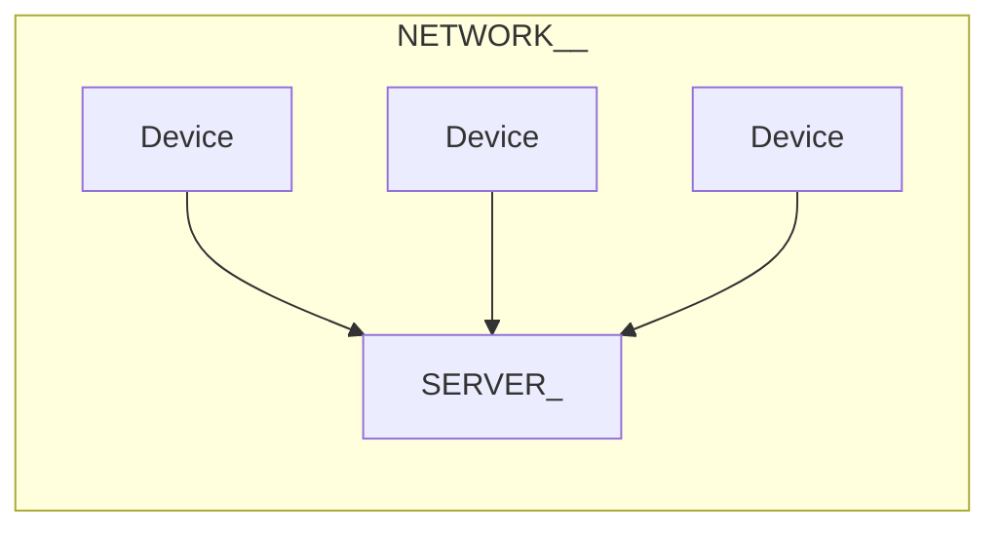
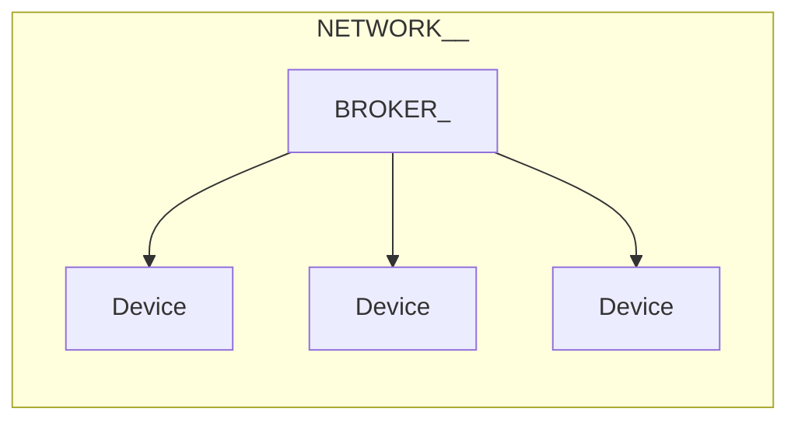

# Послушный дом и JS

## Женя Кучерявый

---
layout: two-cols
---

<div style="font-size: 1rem; line-height: 1rem;">
                                                                                     
                                                                                     
                                                                                     
                                                                                     
                                  ░  ░ ░░░░░░░░░░░                                   
                                ░         ░░░▓▒░▒░░░▒░                               
                            ░           ░░▒▒▒▒░░ ░░░░░                               
                           ░        ░░░░ ░░▒▓░░░▒▒  ▒▒░░                             
                         ░░                ░░░▒▒▓█▓░  ░                              
                        ░░              ░░░▒▓████████░░  ░                           
                        ░          ░░░▒▒▒▒▓████████████░                             
                        ░         ░ ░▒▒▒▓▓█████████████ ░                            
                       ░           ░░▒▓▓▓▓██████████████                             
                      ░           ░▒▒▒▓▓▓▓██████████████                             
                      ░░         ░▒▒▒▒▓▓▓██▓▓▒░░░▓███▓░░▒                            
                    ░░░  ░░░░   ░░▒▒▒▒▒▓▒▒▒▒░  ░▒▒▒▒▒  ▒                             
                    ░ ░  ░░▒░▒░░░░▒▒▒▓▓▓▓▒▒▒▒▒░░▒▓██░▒██                             
                   ░      ▒░░░▒░▒▒▒▓▒▓▓▓████████████████                             
                  ░ ░░    ░░▒▒▒▒▒▒▒▒▒▒▒▒▓▓██████▓▓██████                             
                     ░   ░ ░▒▒▒▒▒▒▒▒▒▒▒▒▒▓▓████▒▓▓▓▒████                             
                     ░   ░░░ ░░░▒▒▒▒▒▒▒▒▒▒▒▒▒██▒░░░░▓█▓                              
                     ░   ░░░░ ░▒▒▒▒▒▒▒▒▒▒▒▒▓▓▒▓██▒▒▒███                              
                      ░  ░  ░░▒▒▒▒▒▒▒▒▒▒▒▒▒▓██▒▓▒▒▒███                               
                    ░ ░░ ░ ░░▒▒▒▒▒▒▒▒▒▒▒▒▒▒▓▓████████                                
                       ░ ░░ ▒▒▒▒▒▒▒▒▒▒▒▒▒▒▒▒▓████████                                
                       ░ ░ ░░▒▒▒▒▒▒▒▒▒▒▒▒▒▒▒▒▒▒▒▒▓▒▓                                 
                             ▒▒▒▒▒▒▒▒▒▒▒▒▒▒▒░░░░░                                    
                            ░▒▒▒▒▒▒▒▒▒▒▒▒░░░░░  ░░░                                  
                             ░░▒▒▒▓▒▒▒▒▒▒▒░░   ░░░░░░░░░                             
                       ░       ░░▒▒▒▒▒▒░░░    ░░░░░░░░░░░░░░░░░                      
                   ░            ░░░▒░░░░      ░░░░░░░░░░░░░░░░░░░░░░░                
               ░░                  ░░         ░░░░░░░░░░░░░░░░░░░░░░░░░░             
           ░                                  ░░░░░░░░░░░░░░░░░░░░░░░░░░░░           
                                           ░░░░░░░░░░░░░░░░░░░░░░░░ ░ ░░░░░          
                                   ░        ░  ░░░░░░░░░░░░░░░░░░░░░ ░░░░░░░░        
                                          ░░░░░░░░░░░░░░░░░░░░░░ ░░  ░░░░ ░░░░       
                                         ░░░░░░░░░░░░░░░░░░░░░░░  ░    ░░░ ░ ░       
                                       ░░░░░░░░░░░░░░░░░░░░░░░░░░    ░ ░░  ░░ ░      
                                       ░░░░░░░░░░░░░░░░░░░░░░░░░░░░  ░     ░░  ░     
                                        ░ ░░░░░░░░░░░░░░░░░░░░░░░░░░        ░░  ░    
                                              ░░░░░░░░░░░░░░░░░░░ ░░        ░░  ░    
                        ░                     ░░░░ ░░  ░░░░░░░░░   ░         ░░  ░   
                         ░ ░░                              ░   ░             ░░  ░   
                         ░                                      ░░                ░  
                                                                 ░             ░░░░░ 
                                                                              ░░░░░░ 

</div>

::right::

# Женя Кучерявый

<br>

<v-clicks>

- Вольнодумец
- Суперзлодей

</v-clicks>

---
layout: terminal
text: Электроника на HolyJS?
preload: false
---

---

# Почему фротендеры идеально справятся с электроникой<span class="red">:</span>

<br>

<v-clicks>

- Любят называть себя инженерами
- Красили кнопки<span class="red">,</span> а будут красить светодиоды
- Электронику невозможно понять до конца <span class="red">(</span>и не нужно<span class="red">)</span>
- Фронтендер даже не попытается

</v-clicks>

---
layout: cover
class: text-center
---

# Знания JS будет достаточно

---
layout: terminal
text: Что такое послушный дом?
preload: false
---

<RenderWhen context="main">
<TermPrinter text="Что такое послушный дом?" />
</RenderWhen>

---
layout: cover
background: /lain-cables.jpg
preload: false
---

<RenderWhen context="main">
<TermPrinter size="3rem" text="Это система управления домашней сетью электрических устройств, которая слушается владельца, а не додумывает" />
</RenderWhen>

---
layout: cover
---

# Послушный дом почти как умный<span class="red">,</span> но тупой

<Source value="© Фонд золотых цитат" />


---
layout: video-side
side: left
loop: false
autoplay: false
video: /iceberg-glow-1.mp4
preload: false
---

# Айсберг

---
layout: video-side
side: left
loop: false
autoplay: true
video: /iceberg-glow-1.mp4
preload: false
---

# Айсберг

<br>

<v-clicks>

- Информация поделена на уровни
- Чем дальше<span class="red">,</span> тем сложнее

</v-clicks>

---
layout: layer
layer: 0
---

# Дисклеймер

---
layout: image
image: /chat-gpt-wiring.webp
backgroundSize: 39rem
---

<Arrow x1="50" x2="340" y1="300" y2="330" color="red" width="5" v-click />

<Source value="ChatGPT" />

---
layout: image
image: /chat-gpt-wiring-2.webp
backgroundSize: 39rem
---

<Source value="ChatGPT" />

---
layout: image
image: /bro-you-will-die.jpg
backgroundSize: 70rem
class: text-center
---

<div class="tiny-title bg-blur" style="font-size: 3rem">
Бро<span class="red">,</span> ты умрёшь и т<span class="red">.</span> д<span class="red">.</span>
</div>

---
layout: image
image: /plug-wiring-risk.png
backgroundSize: 78rem
---

<Source value="ChatGPT" />

---
layout: image-left
image: /ololoshka.svg
backgroundSize: 30rem
---

# Мечта детства <span color="red">№</span>2026

<br>
<br>
<br>
<br>
<br>

<div style="font-size: 2.8rem;">Застать крах ИИ и убытки ИТ<span class="red">-</span>гигантов</div>

---
layout: terminal
text: Соблюдайте технику безопасности
preload: false
---

---
layout: layer
layer: 1
---

# На всё<br>готовое

---
layout: image
image: /sharikov-bw.webp
---

<div class="bg-blur tiny-title text-center position-absolute bottom-20" style="font-size: 3rem">
Скачаю Home assistant<span class="red">,</span> настрою Zigbee</div>

<Source value="х/ф Собачье сердце" />

---
layout: cover
---

# Вендоры <span class="red">—</span> злые

---
layout: image-right
image: /rupert.jpg
backgroundSize: 35rem
---

<br>
<br>
<br>
<br>
<br>
<br>
<br>

# Не стоит недеяться на чужую инфру<span class="red">,</span> вендоров или интернет

<div class="bg-blur" style="position: absolute; right: 13rem; top: 3rem; font-size: 2rem;">Интернет</div>

<Source value="х/ф Гарри Поттер и Философский камень" />

---
layout: image
image: /zigbee.webp
backgroundSize: 37rem
class: bg-black
---

---
layout: layer
layer: 2
---

# Голосовой ассистент

---
layout: image-right
image: /zero2-hero.webp
backgroundSize: 40rem
---

# Raspberry Pi Zero 2 W

<br>

<v-clicks>

- 4 ядра 64<span class="red">-</span>bit 1 GHz
- 512MB SDRAM
- Wireless
- Mini HDMI
- CSI<span class="red">-</span>2
- 40 пинов GPIO

</v-clicks>


<Source value="https://www.raspberrypi.com/products/raspberry-pi-zero-2-w/" />

---
layout: cover
---

# Есть Mini HDMI<span class="red">,</span> но нельзя использовать браузер <span class="red">—</span> слишком мало оперативки

---
layout: image
image: /larana-pix.jpg
backgroundSize: 70rem
---

<Source value="https://larana.tech" />

---
layout: image
image: /pad/duck.webp
---

---
layout: image
image: /pad/pi.webp
---

---
layout: image
image: /pad/sound-module.webp
---

---
layout: image
image: /pad/pi-sound.webp
---

---
layout: cover
background: /lain-cables.jpg
---

<RenderWhen context="main">
<TermPrinter text="Если я купил железку,то это моя железка!" />
</RenderWhen>

---
layout: image
image: /pad/radio.webp
---

---

<div><SlidevVideo
src="/pad/mic1.webm" :autoplay="true" :controls="false" :muted="true"
autoreset="slide"
style="position: absolute; width: 100%; height: 100%; top: 0; bottom: 0; left: 0; right: 0;" ></SlidevVideo>
</div>


---

<div><SlidevVideo
src="/pad/mic2.webm" :autoplay="true" :controls="false" :muted="true"
autoreset="slide"
style="position: absolute; width: 100%; height: 100%; top: 0; bottom: 0; left: 0; right: 0;" ></SlidevVideo>
</div>

---
layout: image
image: /pad/amp.webp
---

---
layout: image
image: /pad/speaker.webp
---

---
layout: image
image: /pad/speaker-lay.webp
---

---

<div><SlidevVideo
src="/pad/sound.webm" :autoplay="true" :controls="false" :muted="true"
autoreset="slide"
style="position: absolute; width: 100%; height: 100%; top: 0; bottom: 0; left: 0; right: 0;" ></SlidevVideo>
</div>

---

TODO: device photo

---
layout: terminal
text: Распознавание речи
preload: false
---

---
layout: cover
class: text-center
---

# Vosk

---
layout: code
---

````md magic-move

```js{all|7-8|10-17}
import vosk from "vosk"
import record from "node-record-lpcm16"

const modelPath = "./model"
const sampleRate = 16000

const model = new vosk.Model(modelPath)
const rec = new vosk.Recognizer({ model, sampleRate })

const mic = record.record({
    sampleRateHertz: sampleRate,
    threshold: 0,
    verbose: false,
    recordProgram: "rec",
    channels: 1,
    audioType: "raw",
})
```

```js
const micStream = mic.stream()

micStream.on("error", console.error)

process.on("SIGINT", () => {
    mic.stop()
    const final = rec.finalResult()
    rec.free()
    model.free()
    process.exit(0)
})
```

```js{all|2-4|4-11}
micStream.on("data", (data) => {
    if (rec.acceptWaveform(data)) {
        // end of phrase
    } else {
        const partial = rec.partialResult()
        if (partial && partial.partial) {
            process.stdout.write(
                `\rPartial: ${partial.partial}`,
            )
        }
    }
})
```

```js{all|2-13|3|4|9|11-12}
micStream.on("data", (data) => {
    if (rec.acceptWaveform(data)) {
        const res = rec.result()
        if (!res || !res.text) {
            return
        }
        console.log("\nResult:", res.text)

        const text = res.text.replace(`${ALIAS} `, "")

        const c = commands[text]
        c && c()
    } else {/* Partial */}
})
```

```js
const ALIAS = "жаба"

const commands = {
    "пауза": handlePause,
    "играй": handlePlay,
    "дальше": handleNext,
    "назад": handlePrev,
    "свет": handleLampToggle,
    "зелёный свет": () => handleLightState({
        on: true, r: 0, g: 255, b: 0,
    }),
}
```

```js
function run(cmd) {
    return new Promise((resolve, reject) => {
        exec(cmd, {shell: true}, (err, stdout, stderr) => {
            if (err) return reject({err, stderr})
            resolve(stdout)
        })
    })
}

const handlePause = () => run("mpc pause")
const handlePlay = () => run("mpc play")
const handlePrev = () => run("mpc prev")
const handleNext = () => run("mpc next")
```

```js
const SERVER = "http://0.0.0.0:3000"

const handleLampToggle = async () => {
    await fetch(SERVER + "/lamp/toggle")
}

const handleLightState = async (data) => {
    await fetch(SERVER + "/led/state", {
        method: "post", body: JSON.stringify(data),
    })
}
```

````

---
layout: center
---

<div class="big-title">DEMO</div>

---
layout: layer
layer: 3
---

# Мигаем светодиодом

---
layout: terminal
text: Микроконтроллеры
size: 4rem
preload: false
---

---
layout: cover
background: /lain-cables.jpg
preload: false
---

<RenderWhen context="main">
<TermPrinter size="2.8rem" text="Микроконтроллер — программируемое устройство, которое может принимать и отправлять электрические сигналы" />
</RenderWhen>

---
layout: image
image: /esp32-o.webp
backgroundSize: 60rem
transition: slide-left
---

<Arrow x1="800" x2="600" y1="400" y2="380" width="6" color="red" v-click />

---
layout: image-left
image: /esp32-o.webp
backgroundSize: 40rem
---

# ESP32

<br>

<v-clicks>

- 2 ядра 32<span class="red">-</span>bit 240 MHz
- 520 KB SRAM
- 4 MB Flash<span class="red">-</span>память
- Wi<span class="red">-</span>Fi <span class="red">&</span> Bluetooth
- До 32 пинов GPIO

</v-clicks>

---
layout: cover
---

# General Purpose Input<span class="red">/</span>Output

<br>
<br>

# Ввод<span class="red">/</span>вывод общего назначения

---
layout: image
image: /esp32.png
backgroundSize: 30rem
transition: slide-left
---

---
layout: image-left
image: /esp32.png
backgroundSize: 30rem
---

# ESP32 DevKit

<br>

<v-clicks>

- Плата для разработки
- USB<span class="red">-</span>порт для питания и прошивки
- Вывод пинов для удобной работы на макетной плате

</v-clicks>

---
layout: image
image: /pad/duck.webp
---

---
layout: image
image: /pad/esp.webp
---

---
layout: terminal
text: Зачем делать это на JS?
preload: false
---

---
layout: cover
background: /lain-cables.jpg
preload: false
---

<RenderWhen context="main">
<TermPrinter text="1. Потому что мы можем" />
</RenderWhen>

---
layout: cover
background: /lain-cables.jpg
preload: false
---

<RenderWhen context="main">
<TermPrinter size="3rem" text="2. Всё, что может быть написано на JS, будет написано на JS" />
</RenderWhen>

---
layout: cover
---

# Как написать прошивку на JS

---

# 2 способа запустить JS на контроллере<span class="red">:</span>

<br>

<v-clicks>

1. Компиляция прошивки
2. Загрузить среду исполнения на контроллер

</v-clicks>

---
layout: image
image: /pico-2s.png
backgroundSize: 60rem
---

<Source value="https://www.raspberrypi.com/documentation/microcontrollers/pico-series.html" />

---
layout: terminal
text: Мы не на конфе для питонистов
preload: false
---

---
layout: image-left
image: /espruino.png
backgroundSize: 5rem
---

# Espruino

<br>

<v-clicks>

- Среда выполнения JS для микроконтроллеров
- Веб<span class="red">-</span>IDE с настройкой в один клик
- Прошивки для популярных плат
- Готовые устройства

</v-clicks>

<Source value="https://www.espruino.com" />

---
layout: image
image: /espruino-ide-1.png
---

<Source value="https://www.espruino.com" />

---
layout: image
image: /espruino-ide-2.png
---

<Source value="https://www.espruino.com" />

---
layout: code
---

```js{all|2,4|8-11|6,10|9|all}
// DEVICE
var LED_PIN = 2;

pinMode(LED_PIN, "output");

var on = false;

setInterval(function () {
    digitalWrite(LED_PIN, on);
    on = !on;
}, 500);
```


<BlinkAnimation style="position: absolute; bottom: 20.5rem; right: 12.77rem" v-click/>

---
layout: layer
layer: 4
---

# Сеть

---
layout: two-cols
---

# Способы связи

<br>

<v-clicks>

- Проводные
- Беспроводные

</v-clicks>

::right::

# Протоколы

<br>

<v-clicks>

- TCP
- UDP
- HTTP
- MQTT
- I<sup class="red">2</sup>C
- USB

</v-clicks>

---
layout: cover
---

# 1 Сервер <span class="red">&</span> Много клиентов

---
layout: center
---



---
layout: code
---

````md magic-move
```js
// SERVER
let state = false

const server = http.createServer(async (req, res) => {
    switch (req.url) {
        case "/lamp/state":
            reply(res, 200, state ? "1" : "0")
            break
        case·"/lamp/toggle":
            state = !state
            reply(res, 200, state ? "1" : "0")
    }
})
```

```js
// DEVICE
pinMode(RELAY_PIN, "output");

function update() {
    httpGet(BASE_URL, "/lamp", function (_, _, body) {
        if (body === "1") {
            digitalWrite(RELAY_PIN, 1);
        } else {
            digitalWrite(RELAY_PIN, 0);
        }
    });
    setTimeout(function() { update(); }, 400);
}
```

````

---
layout: cover
---

# RPS <span class="red">=</span> N <span class="red">×</span> 2


---
layout: cover
---

# Лучше один раз отправить обновление на устройство<span class="red">,</span> чем всё время дудосить сервер

---
layout: cover
---

# Каждое устройство <span class="red">—</span> сервер

---
layout: center
---



---
layout: code
---

````md magic-move

```js
// BROKER
let state = false

const server = http.createServer(async (req, res) => {
    switch (req.url) {
        case·"/lamp/toggle":
            state = !state
            const endpoint = state ? "1" : "0"
            await fetch(`${DEVICE_IP}/${endpoint}`)
            res.end(body)
    }
})
```

```js
// DEVICE
pinMode(RELAY_PIN, "output");

const server = http.createServer(function (req, res) {
    if (req.url === "/1") {
        digitalWrite(RELAY_PIN, 1);
        res.end("ACK: ON");
    } else if (req.url === "/0") {
        digitalWrite(RELAY_PIN, 0);
        res.end("ACK: OFF");
    }
});
```

````

---
layout: image
image: /shenzhen.png
---

<Source value="Shenzhen I/O" />

---
layout: image
image: /shenzhen-docs.png
transition: slide-left
---

<Source value="Shenzhen I/O" />

---
layout: image-left
image: /psyche.jpg
---

<br>
<br>
<br>
<br>
<br>
<br>

# Везенье<span class="red">,</span> если <span class="green">есть</span> data sheet

<br>
<br>
<br>
<br>
<br>
<br>

<v-click>

# Веселье<span class="red">,</span> если его <span class="red">нет</span>

</v-click>

<Source value="а/с Эксперименты Лэйн"/>

---
layout: image
image: /pad/e-ink.webp
---

---
layout: image
image: /pad/e-ink-pins.webp
---

---
layout: image-right
image: /lain-repair.jpg
---
<div class="bg-blur" style="font-size: 2rem; flex: 1;">
Дорогой<span class="red">,</span> хватит ломать технику<span class="red">,</span>
ты не реверс<span class="red">-</span>инженер<span class="red">...</span>
</div>


<Source value="а/с Эксперименты Лэйн"/>

---
layout: image
image: /ron.jpg
---

<Source value="х/с Парки и зоны отдыха" />

---
layout: layer
layer: 5
---

# Послушная розетка

---
layout: cover
---

# Концептуально всё просто<span class="red">:</span>

<br>

# Делаем всё то же самое<span class="red">,</span> но вместо светодиода <span class="red">—</span> лампа

---
layout: image-right
image: /any-padme.jpg
---

<br>
<br>
<br>
<br>
<br>
<br>

# Всё будет так же просто<span class="red">.</span>

<br>
<br>
<br>
<br>
<br>

# Будет же<span class="red">,</span> да<span class="red">?</span>

<Source value="х/ф Звёздные войны: Эпизод 2 — Атака клонов" />

---
layout: cover
background: /wires-lain.jpg
preload: false
---

<TermPrinter text="Код — абстракция над электричеством" />

---
layout: cover
---

# Электрический ток <span class="red">—</span> упорядоченное движение заряженных частиц

---
layout: cover
---

# Фронтендер <span class="red">—</span> интернет<span class="red">-</span>сантехник

---
layout: cover
---

# С некоторыми допущениями<span class="red">,</span> электрический ток <span class="red">—</span> вода

---
layout: cover
---

# С некоторыми допущениями<span class="red">,</span> любая еда <span class="red">—</span> чизбургер

<Source value="© Тихон Шёпотов" />

---
layout: cover
---

# Напряжение <span class="red">(</span>Вольт<span class="red">)</span> <span class="red">—</span> давление

<br>

# Сила тока <span class="red">(</span>Ампер<span class="red">)</span> <span class="red">—</span> поток воды <span class="red">(</span>объём в единицу времени<span class="red">)</span>

---
preload: false
clicks: 1
---

# Электрический ток


<RenderWhen context="main">
<TransformerDemo />
</RenderWhen>

---
layout: cover
---

# Почему светится лампа накаливания<span class="red">?</span>

---
layout: image
image: /acdc/lamp.webp
transition: slide-left
---

# Обычная лампа

---
layout: image-left
image: /acdc/lamp-8.webp
---

<div style="display: flex; align-items: center; justify-content: center;">
<LedElement :value="255" />
</div>

<br>
<br>
<br>
<br>

<v-click>

# Для протекания тока нужен замкнутый контур

</v-click>

---
layout: image
image: /acdc/lamp-with-button.webp
---

# Лампа с кнопкой

---

<HLExample />

---
layout: image
image: /acdc/base.webp
transition: slide-left
---

---
layout: image-left
image: /acdc/base-8.webp
preload: false
---

<br>

<CurrentChart type="AC" :voltage="220" :freq="50" />

---
layout: two-cols
preload: false
---

# В российских розетках<span class="red">:</span>

<br>

<v-clicks>

- Переменный ток <span class="red">(</span>AC<span class="red">),</span> который меняет полярность<br>50 раз в секунду <span class="red">(</span>Гц<span class="red">)</span>
- Примерно <span class="red">~</span>220<span class="red">-</span>230 V

</v-clicks>

::right::

<br>

<CurrentChart type="AC" :voltage="220" :freq="50" />

---
layout: cover
---

# Лампочке нужно 220 V AC<span class="red">,</span> а микроконтроллеру <span class="red">—</span> 5 V DC

---
layout: cover
---

# Вижу цель<span class="red">,</span> не вижу препятствий

---

# Что нужно сделать<span class="red">:</span>

<br>

<v-clicks>

- AC <span class="red" style="font-size: 4rem">→</span> DC
- Синусоида <span class="red" style="font-size: 4rem">→</span> Прямая
- 220 V <span class="red" style="font-size: 4rem">→</span> 5 V

</v-clicks>

---
layout: image-left
image: /acdc/base-8.webp
preload: false
---

<br>

<CurrentChart type="AC" :voltage="220" :freq="50" />

---
layout: video-side
video: /diode-glow-1.mp4
---

# Диод

<br>

<v-clicks>

- Диод пропускает электричесткий ток только в одном направлении
- Некоторые диоды при прохождении тока светятся
- <span class="orange">~</span> Клапан

</v-clicks>

---
layout: image
image: /acdc/diode.webp
transition: slide-left
---

---
layout: image-left
image: /acdc/diode-8.webp
preload: false
---

<br>

<CurrentChart type="PREDC" :voltage="220" :freq="50" />

---
layout: image
image: /acdc/bridge.webp
transition: slide-left
---

---
layout: image-left
image: /acdc/bridge-8.webp
preload: false
---

<br>

<CurrentChart type="DC" :voltage="220" :freq="50" />

---
layout: video-side
video: /capacitor-glow-1.mp4
transition: slide-left
---

# Конденсатор

<br>

<v-clicks>

- Конденсатор накапливает электрический заряд
- Когда ёмкость конденсатора заполняется<span class="red">,</span> он разряжается<span class="red">,</span> если есть нагрузка
- <span class="orange">~</span> Сифон

</v-clicks>


---
layout: cover
transition: slide-left
---

# Не трогайте конденсаторы руками<span class="red">!</span>

---
layout: video-side
video: /capacitor-glow-1.mp4
side: left
preload: false
---

<br>

<CapacitorExample />

---
layout: image
image: /acdc/capacitor.webp
transition: slide-left
---

---
layout: image-left
image: /acdc/capacitor-8.webp
preload: false
---

<br>

<CurrentChart type="DC" :voltage="300" :max="500" :freq="0" />

---
layout: image-right
image: /coil.svg
backgroundSize: 35rem
---

# Трансформатор

<br>

<v-clicks>

- Ж<span class="red">-</span>ж<span class="red">-</span>ж<span class="red">-</span>ж<span class="red">-</span>ж<span class="red">-</span>ж
- Трансформатор понижает <span class="red">(</span>или повышает<span class="red">)</span> напряжение за счёт электромагнитной индукции
- <span class="orange">~</span> Без понятия<span class="red">,</span> с чем сравнить

</v-clicks>

---
preload: false
clicks: 7
---

<RenderWhen context="main">
<TransformerDemo />
</RenderWhen>

---
layout: image
image: /acdc/coil.webp
transition: slide-left
---

---
layout: image-left
image: /acdc/coil-8.webp
preload: false
---

<br>

<CurrentChart type="DC" :voltage="46" :max="220" :freq="0" />

---
layout: video-side
side: right
video: /transistor-glow-1.mp4
---

# Транзистор

<br>

<v-clicks>

- Три ножки<span class="red">:</span> исток<span class="red">,</span> сток и затвор
- Ток протекает от истока к стоку<span class="red">,</span> если есть напряжение на затворе
- <span class="orange">~</span> Кран

</v-clicks>

---
layout: image
image: /acdc/pwm.webp
transition: slide-left
---

---
layout: image-left
image: /acdc/pwm-8.webp
preload: false
---

<br>

<CurrentChart type="DC" :voltage="5" :max="20" :freq="0" />

---
layout: cover
---

# Мы придумали блок питания<span class="red">*</span>

<div class="position-absolute bottom-5" style="font-size: 2rem">
<span class="red">*</span> Это очень упрощённая схема</div>

---
layout: cover
transition: slide-left
---

# И теперь придётся паять блок питания для каждого проекта<span class="red">?</span>

---
layout: image-right
image: /ps.webp
---

<br>
<br>
<br>
<br>
<br>
<br>
<br>
<br>
<br>
<br>
<br>

# Можно купить готовый

---
layout: cover
---

# Мы знаем почти достаточно<span class="red">,</span> чтобы собрать лампочку

---
preload: false
clicks: 2
---

# Реле


<RenderWhen context="main">
<RelayDemo />
</RenderWhen>

---
layout: image
image: /esp-lamp.webp
---

---
transition: slide-left
---

<div style="position: absolute; top: 0; left: 0; right: 0; bottom: 0; display: flex; width: 100%; height: 100%;">


</div>

---
layout: image-left
image: /pad/lamp.webp
---

<div class="tiny-title" style="font-size: 2.5rem">
Атеисты такие типа<span class="red">:</span>
<br><br>
Оно работает благодаря высокому качеству сборки и хорошему коду</div>

---
layout: center
---

<div class="big-title">DEMO</div>

---
layout: cover
---

# Мы покрыли 95<span class="red">%</span> кейсов послушного дома<span class="red">*</span>

<div class="position-absolute bottom-5" style="font-size: 3rem"><span class="red">*</span> Я взял этот процент от балды</div>

---
layout: layer
layer: 6
---

# Дисплей

---
layout: code
---

````md magic-move

```js{all|2}
// DEVICE
var LED_PIN = 2;

pinMode(LED_PIN, "output");

var on = false;

setInterval(function () {
    digitalWrite(LED_PIN, on);
    on = !on;
}, 1000);
```

```js{2|all}
// DEVICE
var LED_PIN = 33;

pinMode(LED_PIN, "output");

var on = false;

setInterval(function () {
    digitalWrite(LED_PIN, on);
    on = !on;
}, 1000);
```

````

---
layout: image
image: /led-with-esp.webp
---

<br>

# Диод и ESP32

<Arrow x1="600" x2="600" y1="250" y2="130" width="6" color="orange" v-click />

---
layout: center
---

# Закон Ома


<Source value="https://commons.wikimedia.org/wiki/File:Ohm's-law-triangle.svg" />

---
layout: two-cols
transition: slide-left
---

# Закон Ома

<br>

<v-clicks>

- U <span class="red">—</span> Напряжение
- I <span class="red">—</span> Сила тока
- R <span class="red">—</span> Сопротивление

</v-clicks>

::right::

<div style="font-size: 4rem; height: 100%; display: flex; align-items: center" v-click>
I <span class="red">=</span> U <span class="red">÷</span> R
</div>

---
layout: two-cols
---

# Закон Ома

<div style="font-size: 4rem; height: 81%; display: flex; align-items: center">
I <span class="red">=</span> U <span class="red">÷</span> R
</div>

::right::

<v-clicks>

- U <span class="red">=</span> 5 V
- R <span class="red">=</span> 1 Ω
- I <span class="red">=</span> 5 <span class="red">÷</span> 1
- I <span class="red">=</span> 5 A

</v-clicks>

---
layout: cover
---

# Стандартный светодиод <span class="red">(</span>5 mm<span class="red">)</span> расчитан на прямой ток 10<span class="red">-</span>20 мА

---
layout: cover
---

# Мы превышаем номинальную силу тока в <span class="red">~</span>250 раз<span class="red">!</span>

---
layout: two-cols
---

# Закон Ома

<div style="font-size: 4rem; height: 81%; display: flex; align-items: center">
R <span class="red">=</span> U <span class="red">÷</span> I
</div>

::right::

<v-clicks>

- U <span class="red">=</span> 5V
- I <span class="red">=</span> 20 mA
- R <span class="red">=</span> 5 <span class="red">÷</span> 0.020
- R <span class="red">=</span> 250 Ω

</v-clicks>

---
layout: video-side
video: /resistor-glow-1.mp4
---

# Резистор

<br>

<v-clicks>

- Все проводники обладают сопротивлением
- Чем выше сопротивление<span class="red">,</span> тем ниже сила тока
- Чем выше сопротивление<span class="red">,</span> тем сильнее нагрев
- <span class="orange">~</span> Редуктор

</v-clicks>

---
layout: video-side
video: /potentiometer-glow-1.mp4
---

# Потенциометр

<br>

<v-clicks>

- Можно думать о потенциометре как о настраиваемом резистре

</v-clicks>

---
layout: image
image: /lamp-with-potentiometer.webp
---

# Лампа с потенциометром

---
layout: cover
---

# Pulse<span class="red">-</span>width modulation

<br><br>

# Широтно<span class="red">-</span>импульсная модуляция

---
layout: center
---

<div style="font-size: 3rem;">
Микроконтроллер может выдавать на пинах либо 0 В<span class="red">,</span> либо 5 В<span class="red">.</span> <span v-click>Но если очень
быстро переключать напряжение<span class="red">,</span></span> <span v-click>то можно добиться эффекта<span class="red">,</span> как будто мы подаём
среднее арифметическое напряжение</span>
</div>

---
preload: false
---

<PwmExample />

---
layout: code
---

```js{all|9|6,11}
// DEVICE
var LED_PIN = 16;

pinMode(LED_PIN, "output");

var brightness = 0.5;

setInterval(function () {
    analogWrite(
        LED_PIN,
        brightness,
    );
}, 500);
```

---
layout: cover
---

# Любой пин можно использовать для ШИМ<span class="red">,</span> если захотеть

---
preload: false
layout: two-cols
---

# Медленный ШИМ

<br>

<CurrentChart type="PWM" :max="10" :voltage="5" :freq="2" :len="0.5" />

::right::

# Быстрый ШИМ

<br>

<CurrentChart type="PWM" :max="10" :voltage="5" :freq="10" :len="0.5" />

---
layout: cover
---

# Много лампочек

---
layout: cover
---

# 8 <span class="red">×</span> 8 <span class="red">=</span> 64

---
layout: cover
---

# 1920 <span class="red">×</span> 1080 <span class="red">=</span> 2 073 600

---
layout: image
image: /8x8-matrix-black.png
---

<Source value="https://circuitstoday.com/interfacing-8x8-led-matrix-with-arduino" />

---
layout: cover
---

# 8 <span class="red">+</span> 8 <span class="red">=</span> 16

---
layout: cover
---

# Последовательное переключение

---
preload: false
---

<DisplayExample />

---
layout: cover
---

# 1920 <span class="red">+</span> 1080 <span class="red">=</span> 3 000

---
layout: image
image: /led-matrix-chip-black.webp
---

<Arrow x1="700" x2="300" y1="350" y2="350" color="red" width="6" v-click />

<Source value="https://circuitdigest.com/microcontroller-projects/arduino-8x8-led-matrix" />

---
layout: cover
---

# I<sup class="red">2</sup>C | I<span class="red">2</span>C | IIC

---
layout: image
image: /i2c-protocol.webp
backgroundSize: 75rem
---

# I<sup class="red">2</sup>C

<Source value="https://quanser-update.azurewebsites.net/quarc/documentation/i2c_protocol.html" />

---
layout: code
---

```js
// DEVICE
I2C1.setup({sda: A4, scl: A5});

var g = require("SSD1306").connect(I2C1, 0x3C, function()
{
    g.clear();
    g.flip();

    g.drawRect(90, 0, 127, 31);
    g.fillRect(90, 34, 127, 63);

    g.flip();
});
```

---
layout: image
image: /larana-display.webp
---

---
layout: cover
background: /wires-lain-2.jpg
preload: false
---

<RenderWhen context="main">
<TermPrinter text="А Doom оно запустит?" />
</RenderWhen>

---
layout: image
image: /esp-pc-1.png
---

<Source value="https://youtu.be/HaO_yZFYG1Q" />

---
layout: image
image: /esp-pc-2.png
---

<Source value="https://youtu.be/HaO_yZFYG1Q" />

---
layout: cover
---

# Для большинства проектов ESP32 <span class="red">слишком</span> мощный

---
layout: cover
---

# В массовом производстве выбирают самый дешёвый контроллер<span class="red">,</span> который удовлетворяет требованиям

---
class: small-table
---

# Бюджет<span class="red">:</span> Лампа

<br>

<v-clicks>

| Компонент | Стоимость <span class="red">(</span>Рубли<span class="red">)</span> |
|-|-----------|
| ESP32 | 235 |
| Блок питания | 121 |
| Модуль реле | 112 |
| Лампа | 91 |
| Итого | 559 |

</v-clicks>

---
class: small-table
---

# Бюджет<span class="red">:</span> Колонка

<br>

<v-clicks>

| Компонент | Стоимость <span class="red">(</span>Рубли<span class="red">)</span> |
|-|-----------|
| Raspberry Pi | 3 000 |
| Усилитель | 319 |
| Блок питания | 121 |
| Звуковая карта | 167 |
| Итого | 3 607 |

</v-clicks>

---
layout: two-cols
---

# Что не посчитано<span class="red">:</span>

<br>

<v-clicks>

- Аккумулятор
- Модуль зарядки
- Динамик
- Микрофон
- Фанера
- Тумблер
- Проводочки

</v-clicks>

::right::

<v-clicks>

- Коннекторы
- Флюс<span class="red">,</span> припой и спирт
- Ацетатная лента
- Термоусадки
- Стяжки
- Винты
- Инструменты
- Время

</v-clicks>

---
layout: layer
layer: 99
---

# Итоги

---

# Итоги<span class="red">:</span>

<br>

<v-clicks>

- На JS можно сделать что угодно
- Электроника <span class="red">—</span> опасное<span class="red">,</span> но интересное хобби
- Не всегда есть <kbd style="font-size: 2rem">CTRL</kbd><span class="red">+</span><kbd style="font-size: 2rem">Z</kbd>
- ~~Смерть в нищете~~ Карьерные перспективы туманны

</v-clicks>

---
layout: two-cols
---

<br>
<br>
<br>
<br>
<br>
<br>
<br>
<br>
<br>
<br>
<br>

# Обсудили много<span class="red">,</span> но мало

::right::

<br>
<br>
<br>

<Qr data="https://kucheriavyi.ru/articles/holyjs26sp-summary" label="kucheriavyi.ru" v-click/>

