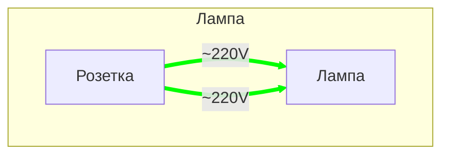
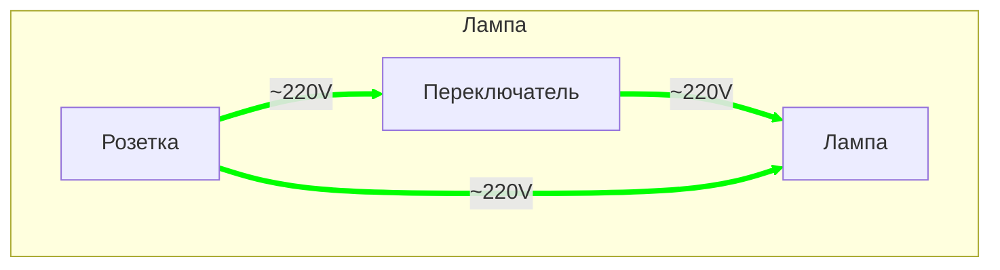
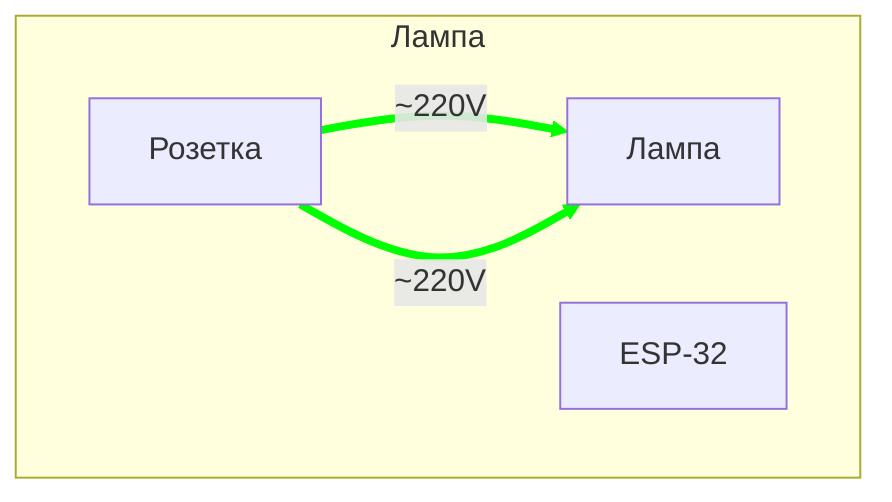
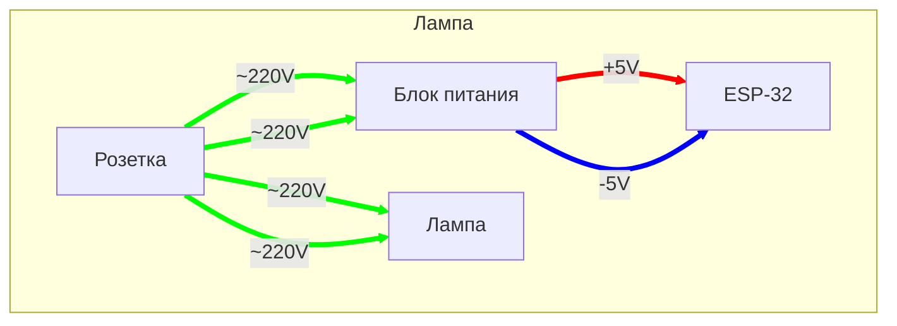
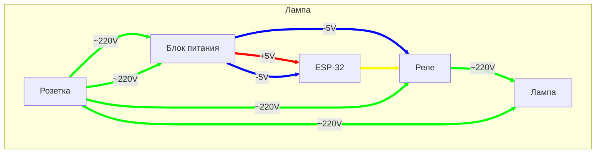
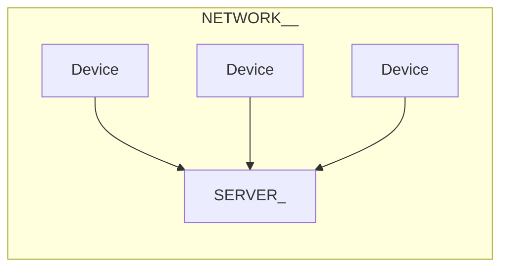
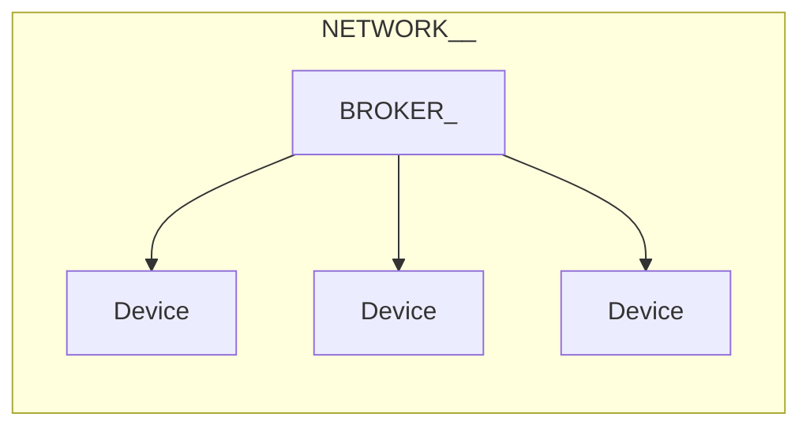

# Послушный дом и JS

## Женя Кучерявый

---
layout: image-right
image: /bazil.webp
---

# Женя Кучерявый

<br>

<v-clicks>

- Вольнодумец
- Суперзлодей

</v-clicks>

---

# Для кого доклад<span class="red">?</span>

<br>

<v-clicks>

- Знаешь, что такое JavaScript
- Знаешь, что такое протокол

</v-clicks>

---
layout: center
class: text-center
---

<div class="tiny-title">Что такое «послушный дом»<span class="red">?</span></div>

---
layout: cover
---

<div style="font-size: 4rem;">Это система управления домашней сетью электрических
устройств<span class="red">,</span> которая слушается
владельца<span class="red">,</span> а не додумывает<span class="red">.</span></div>

---
layout: cover
---

# Это как умный дом<span class="red">,</span> но тупой<span class="red">.</span>

---
layout: center
---

<div class="big-title text-center">Зачем<span class="red">?</span></div>

---
layout: cover
class: text-center
---

# Зачем делать это самому<span class="red">?</span>

---
layout: image-right
image: /subaru-ad.webp
backgroundSize: 38rem
---

# Вендоры <span class="red">—</span> злые

<br>

<v-clicks>

- Смартфоны не чинятся
- Холодильники шпионят
- Принтеры не печают сторонними чернилами
- Лицензии меняются
- Автомобили отвлекают рекламой

</v-clicks>

<Source value="https://www.reddit.com/r/subaru/comments/1p57ohp/these_ads_should_not_be_happening_while_we_are" />

---
layout: center
class: text-center
---

<div class="tiny-title">Если я купил железку<span class="red">,</span> то это моя железка<span class="red">!</span></div>

---
layout: image
image: /pad/radio.webp
---

---

<div><SlidevVideo
src="/pad/mic1.webm" :autoplay="true" :controls="false" :loop="true" :muted="true"
autoreset="slide"
style="position: absolute; width: 100%; height: 100%; top: 0; bottom: 0; left: 0; right: 0;" ></SlidevVideo>
</div>

---
layout: image
image: /pad/acc.webp
---

---
layout: image
image: /home-assistant.png
---

<Source value="https://www.home-assistant.io" />

---
layout: center
class: text-center
---

<div class="tiny-title" style="font-size: 5rem"><span class="red">«</span>У тебя не всегда будет интернет<span class="red">»</span></div>

---
layout: image
image: /zigbee.webp
backgroundSize: 37rem
class: bg-black
---

---
layout: center
---

<div class="tiny-title" style="font-size: 4rem;">Это не под силу ИИ<span class="red">*</span></div>


<div style="position: fixed; bottom: 2rem; font-size: 2rem;"><span class="red">*</span> пока что</div>

---
layout: image-left
image: /ololoshka.webp
---

# Мечта детства <span color="red">№</span>2026

<br>
<br>
<br>
<br>
<br>

<div style="font-size: 2.8rem;">Застать крах ИИ и многомиллиардные убытки ИТ-гигантов</div>

---
layout: image
image: /chat-gpt-wiring.webp
backgroundSize: 39rem
---

<Arrow x1="50" x2="340" y1="300" y2="330" color="red" width="5" v-click />

<Source value="ChatGPT" />

---
layout: image
image: /chat-gpt-wiring-2.webp
backgroundSize: 39rem
---

<Source value="ChatGPT" />

---
layout: image
image: /bro-you-will-die.jpg
backgroundSize: 70rem
class: text-center
---

<div class="tiny-title bg-blur" style="font-size: 3rem">
Бро<span class="red">,</span> ты умрёшь и т<span class="red">.</span> д<span class="red">.</span>
</div>

---
layout: cover
---

# Это не шутка<span class="red">!</span> Будьте осторожны при работе с электричеством<span class="red">.</span> Особенно<span class="red">,</span> если просите советы у нейросетей<span class="red">.</span>


---
layout: image
image: /plug-wiring-risk.png
backgroundSize: 78rem
---

<Source value="ChatGPT" />

---
layout: center
class: text-center
---

<div class="tiny-title">Зачем делать это на JS<span class="red">?</span></div>

---
layout: center
---

<div class="tiny-title" style="font-size: 4.9rem"><span class="red">1.</span> Потому что мы можем<span class="red">.</span></div>

---
layout: cover
---

<div class="tiny-title">
<span class="red">2.</span> Всё<span class="red">,</span> что может быть написано на JS<span class="red">,</span> будет написано на JS<span class="red">.</span>
</div>

---
layout: center
---

<div class="big-title">Как<span class="red">?</span></div>

---
layout: image
image: /nanomachines.jpg
---

<div class="tiny-title text-center bg-blur">Микроконтроллеры</div>

---
layout: cover
---

# Микроконтроллер <span class="red">—</span> программируемое устройство<span class="red">,</span> которое может принимать и отправлять электрические сигналы<span class="red">.</span>

---
layout: image
image: /esp32-chip.webp
backgroundSize: 60rem
---

<Arrow x1="800" x2="600" y1="400" y2="380" width="6" color="red" v-click />

---
layout: image-left
image: /esp32-chip.webp
backgroundSize: 40rem
---

# ESP-32

<br>

<v-clicks>

- 2 ядра 32-bit 240 MHz
- 520 KB SRAM
- 4 MB Flash-память
- Wi-Fi & Bluetooth
- До 32 пинов GPIO

</v-clicks>

---
layout: center
class: text-center
---

<div class="tiny-title">
General Purpose Input<span class="red">/</span>Output
<br>
<br>
Ввод<span class="red">/</span>вывод общего назначения
</div>

---
layout: image
image: /esp32.png
backgroundSize: 30rem
---

---
layout: image-left
image: /esp32.png
backgroundSize: 30rem
---

# ESP-32 DevKit

<br>

<v-clicks>

- Плата для разработки
- USB-порт для питания и прошивки
- Вывод пинов для удобной работы на макетной плате

</v-clicks>

---
layout: image
image: /pad/duck.webp
---

---
layout: image
image: /pad/esp.webp
---

---
layout: center
---

<div class="tiny-title">Как это работает<span class="red">?</span></div>

---
layout: center
---

<div class="small-title">HIGH <span class="red">/</span> LOW
<br>ВКЛ <span class="red">/</span> ВЫКЛ
</div>

---
layout: image
image: /led-with-btn.webp
---

# Диод с кнопкой

<Arrow x1="240" x2="600" y1="280" y2="280" width="6" color="orange" v-click />

---
layout: image
image: /kiss.webp
backgroundSize: 44rem
---

---
layout: image
image: /led-with-btn.webp
---

# Диод с кнопкой

<Arrow x1="390" x2="390" y1="350" y2="220" width="6" color="orange" v-click />

---
preload: false
---

<HLExample />

---
layout: image
image: /led-with-esp.webp
---

<br>

# Диод и ESP-32

---
layout: code
---

```js{all|2,4|6-11|7-10|8|9}
// DEVICE
const LED_PIN = 33

pinMode(LED_PIN, "output")

setInterval(() => {
    digitalWrite(
        LED_PIN,
        digitalRead(LED_PIN) ^ 1,
    )
}, 1000)
```

---
layout: image
image: /led-with-btn.webp
---

# Диод с кнопкой (и резистор)

<Arrow x1="550" x2="550" y1="350" y2="220" width="6" color="orange" v-click />

---
layout: center
---

# Закон Ома


<Source value="https://commons.wikimedia.org/wiki/File:Ohm's-law-triangle.svg" />

---
layout: two-cols
transition: slide-left
---

# Закон Ома

<br>

<v-clicks>

- R — Сопротивление
- U — Напряжение
- I — Сила тока

</v-clicks>

::right::

<div style="font-size: 5rem; height: 100%; display: flex; align-items: center" v-click>
I <span class="red">=</span> U <span class="red">/</span> R
</div>

---
layout: two-cols
---

# Закон Ома

<div style="font-size: 5rem; height: 81%; display: flex; align-items: center">
I <span class="red">=</span> U <span class="red">/</span> R
</div>

::right::

<v-clicks>

- R = 1 Ω
- U = 5 V
- I = 5/1
- I = 1 A

</v-clicks>

---
layout: center
class: text-center
---

<div class="tiny-title">Стандартный светодиод <span class="red">(</span>5 mm<span class="red">)</span> расчитан на прямой ток 10<span class="red">-</span>20 мА</div>

---
layout: center
class: text-center
---

<div class="tiny-title" style="font-size: 4rem">Мы превышаем номинальную силу тока в 55 раз<span class="red">!</span></div>

---
layout: image-right
image: /resistors.png
backgroundSize: 37rem
---

# Что такое резистор<span class="red">?</span>

<br>

- Все проводники обладают сопротивлением.
- Чем выше сопротивление, тем ниже сила тока при равном напряжении.
- Чем выше сопротивление, тем сильнее нагревается проводник.

<Source value="https://commons.wikimedia.org/wiki/File:Electronic-Axial-Lead-Resistors-Array.jpg" />

---
layout: image
image: /led-with-btn.webp
---

# Диод с кнопкой (и резистор)

<Arrow x1="550" x2="550" y1="350" y2="220" width="6" color="orange" v-click />

---
layout: image
image: /lamp-with-potentiometer.webp
---

# Лампа с потенциометром

---

Схема ШИМ с потенциометром

---
layout: center
class: text-center
---

<div class="tiny-title" style="font-size: 4rem;">
Pulse<span class="red">-</span>width modulation
<br><br>Широтно<span class="red">-</span>импульсная модуляция
</div>

---
layout: center
---

<div style="font-size: 3rem;">
Микроконтроллер может выдавать на пинах либо 0 В<span class="red">,</span> либо 5 В<span class="red">.</span> <span v-click>Но если очень
быстро переключать напряжение<span class="red">,</span></span> <span v-click>то можно добиться эффекта<span class="red">,</span> как будто мы подаём
среднее арифметическое напряжение<span class="red">.</span></span>
</div>

---
layout: code
---

```js{all|2,4|6|8-13|9-12|10|11}
// DEVICE
const LED_PIN = 16

pinMode(LED_PIN, "output")

let brightness = 100

setInterval(() => {
    analogWrite(
        LED_PIN,
        brightness / 255,
    )
}, 500)
```

---
preload: false
---

<PwmExample />

---
layout: center
---

<div class="tiny-title">Любой пин можно использовать для ШИМ<span class="red">,</span> если захотеть</div>

---
layout: center
class: text-center
---

<div class="tiny-title">Последовательное питание</div>

---
preload: false
---

<DisplayExample />

---
layout: center
---

<div class="small-title">8 * 8 <span class="red">=</span> 64</div>

---
layout: center
---

<div class="tiny-title" style="font-size: 4.5rem;">1920 * 1080 <span class="red">=</span> 2 073 600</div>

---
layout: image
image: /8x8-matrix-black.png
---

<Source value="https://circuitstoday.com/interfacing-8x8-led-matrix-with-arduino" />

---
layout: center
---

<div class="small-title">8 + 8 <span class="red">=</span> 16</div>

---
layout: image
image: /led-matrix-chip-black.webp
---

<Arrow x1="700" x2="300" y1="350" y2="350" color="red" width="6" v-click />

<Source value="https://circuitdigest.com/microcontroller-projects/arduino-8x8-led-matrix" />

---
layout: center
---

<div class="small-title">I<sup class="red">2</sup>C|I<span class="red">2</span>C|IIC</div>

---
layout: image
image: /i2c-protocol.webp
backgroundSize: 75rem
---

# I<sup class="red">2</sup>C

<Source value="https://quanser-update.azurewebsites.net/quarc/documentation/i2c_protocol.html" />

---
layout: center
---

<div class="tiny-title">А что оно может<span class="red">?</span></div>

---
layout: image
image: /esp-pc-1.png
---

<Source value="https://youtu.be/HaO_yZFYG1Q" />

---
layout: image
image: /esp-pc-2.png
---

<Source value="https://youtu.be/HaO_yZFYG1Q" />

---
layout: center
class: text-center
---

<div class="tiny-title">Для большинства проектов ESP-32 <span class="red">слишком</span> мощный</div>

---
layout: cover
class: text-center
---

# В массовом производстве выбирают самый дешёвый контроллер, который удовлетворяет требованиям.

---
layout: image
image: /shenzhen.png
---

<Source value="Shenzhen I/O"></Source>

---
layout: image
image: /shenzhen-docs.png
---

<Source value="Shenzhen I/O"></Source>

---
layout: cover
class: text-center
---

# Везенье, если <span class="green">есть</span> data sheet

---
layout: cover
class: text-center
---

# Веселье, если его <span class="red">нет</span>

---
layout: image
image: /pad/e-ink.webp
---

---
layout: image
image: /pad/e-ink-pins.webp
---

---
layout: image
image: /reverse.webp
---

---
layout: image
image: /ron.jpg
---


<Source value="х/с «Парки и зоны отдыха»" />

---

Собираем устройства

---

лампочка

---
layout: center
---




---
layout: center
---



---
layout: center
---



---
layout: center
---



---
layout: center
---



---
layout: image-right
image: /relay.webp
backgroundSize: 24rem
transition: slide-left
---

# Что такое реле<span class="red">?</span>

<br>

<v-clicks>

1. Электромагнитная катушка
2. Металлическая пластина
3. Контакты

</v-clicks>


<Source value="https://en.wikipedia.org/wiki/File:Relay_principle_vertical.jpg" />

---
layout: image-left
image: /relay.webp
backgroundSize: 24rem
---

# Как работает реле<span class="red">?</span>

<br>

<v-clicks>

1. Если подать напряжение на катушку<span class="red">,</span> она примагнитит пластину<span class="red">.</span>
2. Металлическая пластина переключает контакты<span class="red">.</span>
3. Чтобы пластина возвращалась в исходное положение<span class="red">,</span> к ней прикреплена пружина<span class="red">.</span>

</v-clicks>


<Source value="https://en.wikipedia.org/wiki/File:Relay_principle_vertical.jpg" />

---
layout: code
---

```ts
// Relay peuso-code

const getActivePin = (voltageOnCoil: number) => {
    if (voltageOnCoil === 0) {
        return PIN_1
    } else {
        return PIN_2
    }
}

getActivePin(0) // PIN_1

getActivePin(1) // PIN_2
```

---
layout: image
image: /esp-lamp.webp
---

---
transition: slide-left
---

<div style="position: absolute; top: 0; left: 0; right: 0; bottom: 0; display: flex; width: 100%; height: 100%;">


</div>

---
layout: image-left
image: /pad/lamp.webp
---

<div class="tiny-title" style="font-size: 2.5rem">
Атеисты такие типа<span class="red">:</span>
<br><br>
Это устройство работает благодаря высокому качеству сборки и хорошему коду</div>


---


код

---

как прошить на JS

---

dashboard

---
layout: center
---

<div class="tiny-title">Голосовой ассистент</div>

---
layout: image-right
image: /zero2-hero.webp
backgroundSize: 40rem
---

# Raspberry Pi Zero 2 W

<br>

<v-clicks>

- 4 ядра 64-bit 1 GHz
- 512MB SDRAM
- Wi-Fi & Bluetooth
- Mini HDMI & microSD
- CSI-2 camera connector
- 40 пинов GPIO

</v-clicks>


<Source value="https://www.raspberrypi.com/products/raspberry-pi-zero-2-w/" />

---

Есть Mini HDMI, но нельзя использовать браузер для визуала — слишком мало оперативки

---

А вот ларана потянет

---
layout: image
image: /pad/pi.webp
---

---
layout: image
image: /pad/sound-module.webp
---

---
layout: image
image: /pad/pi-sound.webp
---

---

<div><SlidevVideo
src="/pad/mic2.webm" :autoplay="true" :controls="false" :loop="true" :muted="true"
autoreset="slide"
style="position: absolute; width: 100%; height: 100%; top: 0; bottom: 0; left: 0; right: 0;" ></SlidevVideo>
</div>

---
layout: image
image: /pad/amp.webp
---

---
layout: image
image: /pad/speaker.webp
---

---
layout: image
image: /pad/speaker-lay.webp
---

---

<div><SlidevVideo
src="/pad/sound.webm" :autoplay="true" :controls="false" :loop="true" :muted="true"
autoreset="slide"
style="position: absolute; width: 100%; height: 100%; top: 0; bottom: 0; left: 0; right: 0;" ></SlidevVideo>
</div>

---

device

---
layout: code
---

````md magic-move

```js
import fs from "fs"
import vosk from "vosk"
import record from "node-record-lpcm16"
import { exec } from "child_process"

const modelPath = "./model"
const sampleRate = 16000

if (!fs.existsSync(modelPath)) {
    console.error("Model not found at", MODEL_PATH)
    process.exit(1)
}
```

```js
vosk.setLogLevel(0)
const model = new vosk.Model(modelPath)
const rec = new vosk.Recognizer({ model, sampleRate })

const mic = record.record({
    sampleRateHertz: SAMPLE_RATE,
    threshold: 0,
    verbose: false,
    recordProgram: "rec",
    channels: 1,
    audioType: "raw",
})
```

```js
const SERVER = "http://0.0.0.0:3000"

const handleLampToggle = async () => {
    await fetch(SERVER + "/lamp/toggle")
}

const handleLightState = async (data) => {
    await fetch(SERVER + "/led/state", {
        method: "post", body: JSON.stringify(data),
    })
}
```

```js
function run(cmd) {
    return new Promise((resolve, reject) => {
        exec(cmd, {shell: true}, (err, stdout, stderr) => {
            if (err) return reject({err, stderr})
            resolve(stdout)
        })
    })
}

const handlePause = () => run("mpc pause")
const handlePlay = () => run("mpc play")
const handlePrev = () => run("mpc prev")
const handleNext = () => run("mpc next")
```

```js
const ALIAS = "жаба"

const commands = {
    "пауза": handlePause,
    "играй": handlePlay,
    "дальше": handleNext,
    "назад": handlePrev,
    "свет": handleLampToggle,
    "зелёный свет": () => handleLightState({
        on: true, r: 0, g: 255, b: 0,
    }),
}
```

```js
const micStream = mic.stream()

micStream.on("error", console.error)

process.on("SIGINT", () => {
    mic.stop()
    const final = rec.finalResult()
    rec.free()
    model.free()
    process.exit(0)
})
```

```js{all|2-4|4-11}
micStream.on("data", (data) => {
    if (rec.acceptWaveform(data)) {
        // end of phrase
    } else {
        const partial = rec.partialResult()
        if (partial && partial.partial) {
            process.stdout.write(
                `\rPartial: ${partial.partial}`,
            )
        }
    }
})
```

```js{all|2-12|3|4|7|9-10}
micStream.on("data", (data) => {
    if (rec.acceptWaveform(data)) {
        const res = rec.result()
        if (res && res.text) {
            console.log("\nResult:", res.text)

            const text = res.text.replace(`${ALIAS} `, "")

            const c = commands[text]
            c && c()
        }
    } else {/* Partial */}
})
```

````

---
layout: center
---

<div class="big-title">DEMO</div>

---
layout: image
image: /pad/tools.webp
---

---

# Инструменты

<br>

<v-clicks>

- Паяльник
- Флюс и припой
- Пинцет и кусачки
- Проводочки и термоусадки

</v-clicks>

---
layout: two-cols
---

# Способы связи

<br>

<v-clicks>

- Wi-Fi
- Bluetooth
- Zigbee
- ESP now
- Ethernet

</v-clicks>

::right::

# Протоколы

<br>

<v-clicks>

- TCP
- UDP
- HTTP
- MQTT
- I<sup class="red">2</sup>C
- USB

</v-clicks>

---
layout: center
---

<div class="tiny-title" style="font-size: 4rem;">1 Сервер <span class="red">&</span> Много клиентов</div>

---
layout: center
---



---
layout: code
---

````md magic-move
```js
// SERVER
let state = false

const server = http.createServer(async (req, res) => {
    switch (req.url) {
        case "/lamp/state":
            reply(res, 200, state ? "1" : "0")
            break
        case·"/lamp/toggle":
            state = !state
            reply(res, 200, state ? "1" : "0")
    }
})
```

```js
// DEVICE
pinMode(RELAY_PIN, "output")

setInterval(async () => {
    const res = await fetch(`${SERVER}/lamp/state`)

    digitalWrite(
        RELAY_PIN,
        Number(await res.text()),
    )
}, 400)
```

````

---
layout: center
class: text-center
---

<div class="small-title">RPS <span class="red">=</span> N * 2</div>

---
layout: center
---

<div class="tiny-title" style="font-size: 4rem;">Каждое устройство <span class="red">—</span> сервер</div>

---
layout: center
---



---
layout: code
---

````md magic-move

```js
// BROKER
let state = false

const server = http.createServer(async (req, res) => {
    switch (req.url) {
        case·"/lamp/toggle":
            state = !state
            const body = state ? "1" : "0"
            await fetch(DEVICE, { method: "POST", body })
            res.end(body)
    }
})
```

```js
// DEVICE
pinMode(RELAY_PIN, "output")

const server = http.createServer(async (req, res) => {
    switch (req.url) {
        case·"/update":
            digitalWrite(
                RELAY_PIN,
                Number(await res.text()),
            )
            res.end(body)
    }
})
```

````

---
layout: cover
---

# Лучше один раз отправить обновление на устройство<span class="red">,</span> чем всё время дудосить сервер<span class="red">.</span>

---

- Умная розетка
- Умная лампочка

---

KiCAD

---

FreeCAD

корпус

3D-печать

---

# Прошивка

Мы просто перекладываем байтики, чтобы что-то завелось, поэтому похуй, на чём
мы это делаем. Выбирают языки вроде Си в основном потому, что они изначально
под это заточены + потому что есть куча готовых инструментов.

---

Прошить плату можно даже через браузер

---

Управлять платой можно через браузер

---

Моргаем светодиодом на плате

---

блок питания

две вилки

---

бэкдоры в контроллерах

гпу в малинке не опенсорс

---

# Что из этого JS?

- Сервер
- Запуск модели распознавания речи
- Управление устройством через WebSerial API
- Написание прошивки
- Софт для прошивки

---
class: small-table
---

<v-clicks>

| Компонент | Стоимость (Рубли) |
|-|-----------|
| ESP-32 | 235 |
| Raspberry Pi | 3 000 (2 000) |
| Усилитель | 319 |
| Блок питания | 121 |
| Модуль реле | 112 |
| Звуковая карта | 167 |
| Звуковой модуль | 200 |
| Лампа | 91 |
| __Итого__ | 4 245 |

</v-clicks>

---
layout: two-cols
---

# Что не посчитано

<br>

<v-clicks>

- Аккумулятор
- Модуль зарядки
- Динамик
- Микрофон
- Фанера
- Тумблер
- Проводочки

</v-clicks>

::right::

<v-clicks>

- Коннекторы
- Флюс, припой и спирт
- Ацетатная лента
- Термоусадки
- Стяжки
- Винты
- Инструменты
- Время

</v-clicks>

---

# Что мы узнали<span class="red">?</span>

<br>

<v-clicks>

- Зачем делать что-то своими руками
- Что такое микроконтроллеры
- Как взаимодействуют компоненты
- Как подружить устройства по сети
- В каких случаях можно использовать JS
- В каких случаях это оправдано

</v-clicks>

---

# Сложности

<br>

<v-clicks>

- Информации меньше
- Нужно уметь работать руками
- Запчасти не всегда под рукой
- Не всегда есть CTRL<span class="red">+</span>Z
- Есть риск смерти

</v-clicks>

---

# Спасибо за внимание

<br>

<Qr data="https://kucheriavyi.ru" label="kucheriavyi.ru" />

